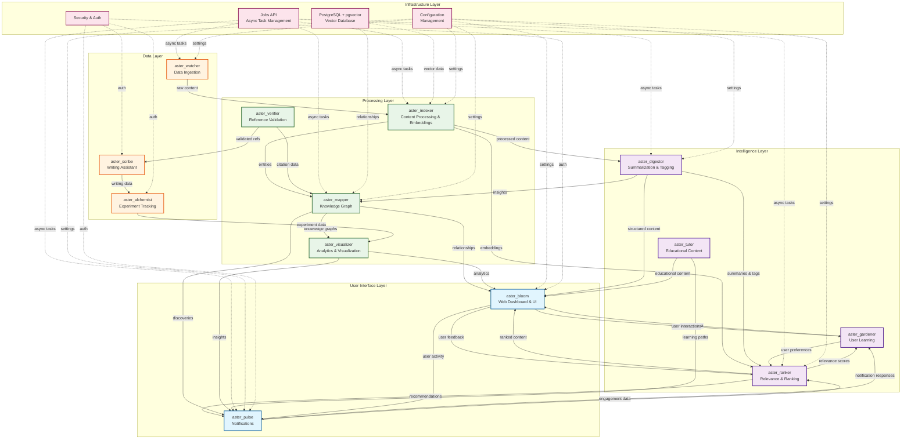

# Aster: Master Project Plan

## 🎯 Project Overview

**Aster** is an autonomous research companion designed to support the complete PhD lifecycle. This document outlines the master plan for building Aster as a modular, scalable system composed of 13 specialized modules, starting with an MVP-first approach.

### Glossary
- **Watcher**: fetch new papers/metadata (arXiv/S2).
- **Indexer**: chunk + embed abstracts, store vectors (pgvector).
- **Digestor**: produce structured summaries.
- **Question Miner**: extract open questions (+ evidence quotes).
- **Bloom**: web UI for search & paper detail.

## 🏗️ System Architecture

### Related Specs
See: jobs_api.md · events_and_data_contracts.md

### Core Philosophy
- **MVP-First**: Single monolith/modulith with clean internal modules, Postgres + pgvector, no Kafka/Neo4j/Elasticsearch in v0
- **Modular Design**: Each module is a separate project with clear interfaces
- **Event-Driven**: Modules communicate via well-defined APIs and event streams
- **Data-Centric**: Centralized knowledge graph with distributed processing
- **AI-First**: Leverage modern AI/ML for intelligent automation
- **User-Centric**: Adaptive to individual researcher workflows and preferences

### MVP Slim Workflow
The MVP implementation follows the **slim workflow**:
```
watcher (arXiv/S2) →
indexer (abstracts only, pgvector) →
digestor (structured summary from abstract) →
open-question miner (abstract or light PDF section) →
ranker (simple recency + similarity) →
bloom (web UI search & detail)
```

**MVP Constraints:**
- No mobile app, no heavy PDF parsing, no real-time collaboration, no multi-interface parity
- Only abstract metadata is ingested; PDFs are optional and light-parsed for "Future Work/Limitations" sections if used
- Open-question miner may use heuristics + LLM on abstracts or light PDF text, returning questions with evidence quotes
- Bloom MVP is web-only with optional CLI fallback; TUI is postponed
- Long-running corpus refresh/distill tasks run via Jobs API and return job_id immediately
- Search over existing corpus is synchronous via REST

### Architecture Layers

#### MVP Architecture Block Diagram
```
┌─────────────────────────────────────────────────────────────┐
│                    User Interface Layer                     │
│  aster_bloom (Web Dashboard) | aster_pulse (Notifications)  │
└─────────────────────────────────────────────────────────────┘
┌─────────────────────────────────────────────────────────────┐
│                   Intelligence Layer                        │
│ aster_digestor | aster_ranker | aster_gardener | aster_tutor│
└─────────────────────────────────────────────────────────────┘
┌─────────────────────────────────────────────────────────────┘
│                   Processing Layer                           │
│  aster_indexer | aster_mapper | aster_verifier | aster_visualizer│
└─────────────────────────────────────────────────────────────┘
┌─────────────────────────────────────────────────────────────┐
│                   Data Layer                                 │
│  aster_watcher | aster_scribe | aster_alchemist             │
└─────────────────────────────────────────────────────────────┘
┌─────────────────────────────────────────────────────────────┐
│                   Infrastructure Layer                      │
│  PostgreSQL + pgvector | Jobs API | Configuration | Security     │
└─────────────────────────────────────────────────────────────┘
```

#### Detailed Mermaid Relationship Diagram


### Module Relationship Details

#### Data Flow Patterns
1. **Content Pipeline**: `aster_watcher` → `aster_indexer` → `aster_digestor` → `aster_ranker`
2. **Knowledge Construction**: `aster_indexer` → `aster_mapper` → `aster_visualizer`
3. **User Experience**: `aster_ranker` → `aster_bloom` → `aster_gardener` (feedback loop)
4. **Notification Chain**: `aster_ranker` + `aster_mapper` → `aster_pulse` → user engagement

#### Key Dependencies
- **aster_watcher**: Foundation module that feeds all content processing
- **aster_indexer**: Central processing hub that enables semantic search and AI features
- **aster_ranker**: Intelligence layer that personalizes content for users
- **aster_bloom**: Primary user interface that integrates all functionality
- **aster_mapper**: Knowledge graph that connects all research relationships

#### Event-Driven Communication
All modules communicate through well-defined event contracts (see `events_and_data_contracts.md`) for:
- Real-time content updates
- User activity tracking
- System health monitoring
- Cross-module data synchronization

## 📋 Module Dependencies & Data Flow

### MVP Phase: Foundation (Modules 1-6)
```
aster_watcher → aster_indexer → aster_digestor → open-question miner → aster_ranker → aster_bloom
```

### Future Phase 2: Intelligence (Modules 7-10)
```
aster_gardener → aster_mapper → aster_verifier → aster_tutor
```

### Future Phase 3: Interface (Modules 11-12)
```
aster_pulse → aster_scribe
```

### Future Phase 4: Specialized (Modules 13)
```
aster_alchemist → aster_visualizer
```

## 🚀 Development Phases

### MVP Phase: Data Ingestion & Processing (Weeks 1-8)
**Goal**: Establish the slim workflow foundation
- **aster_watcher**: Academic source monitoring (arXiv/S2)
- **aster_indexer**: Content processing and embedding (abstracts only, pgvector)
- **aster_digestor**: Summarization and tagging (structured summary from abstract)
- **open-question miner**: Mine open questions from abstracts or light PDF sections
- **aster_ranker**: Relevance scoring (simple recency + similarity)
- **aster_bloom**: Web UI search & detail (web-only with CLI fallback)

**Deliverables**:
- Working slim workflow pipeline
- Basic content processing
- Initial relevance scoring
- MVP web dashboard

### Future Phase 2: Intelligence & Learning (Weeks 9-16)
**Goal**: Add adaptive intelligence capabilities
- **aster_gardener**: User preference learning
- **aster_mapper**: Knowledge graph construction
- **aster_verifier**: Reference validation
- **aster_tutor**: Educational content generation

**Deliverables**:
- Adaptive recommendation system
- Knowledge graph visualization
- Reference auditing
- Study mode functionality

### Future Phase 3: User Experience (Weeks 17-24)
**Goal**: Complete user-facing features
- **aster_pulse**: Notification system
- **aster_scribe**: Writing assistance

**Deliverables**:
- Real-time notifications
- Writing and LaTeX support
- Collaboration features

### Future Phase 4: Specialized Tools (Weeks 25-32)
**Goal**: Advanced research capabilities
- **aster_alchemist**: Experiment tracking
- **aster_visualizer**: Advanced analytics

**Deliverables**:
- Experiment management system
- Advanced visualizations
- Integration with research tools

## 🔧 Technical Standards

### Technology Stack
- **Language**: Python 3.11+
- **Framework**: FastAPI for APIs, Streamlit for dashboards
- **Database**: PostgreSQL + pgvector for vector search
- **AI/ML**: OpenAI API, HuggingFace, LangChain
- **Deployment**: Docker containers, Kubernetes orchestration
- **Monitoring**: Prometheus + Grafana

### Code Quality Standards
- **Testing**: 90%+ coverage, pytest for unit tests
- **Documentation**: Sphinx-generated docs with examples
- **Linting**: ruff for code quality, black for formatting
- **Type Safety**: Full type hints with mypy validation
- **Security**: OWASP compliance, dependency scanning

### API Design Principles
- **RESTful**: Standard HTTP methods and status codes
- **Jobs API**: Async task management for long-running operations
- **Event-Driven**: Async communication between modules
- **Versioning**: Semantic versioning with backward compatibility
- **Authentication**: JWT tokens with role-based access

## 📊 Success Metrics

### MVP Metrics
- **Paper ingestion latency**: < 5 min from arXiv posting to visible dashboard
- **Embedding + summary time**: < 15 sec/paper
- **Relevance ranking F1-score**: > 0.8 compared to manual tagging
- **User satisfaction (self-reported)**: 9/10+ in productivity & motivation

Module metrics inherit/align with these; see each module for local adds.

### Future Targets
- **Performance**: < 5s response time for dashboard queries
- **Reliability**: 99.9% uptime with graceful degradation
- **Scalability**: Support 1000+ concurrent users
- **Data Quality**: 95%+ accuracy in paper classification
- **User Experience**: 80%+ daily active usage, 70%+ feature adoption

## 🔄 Integration Strategy

### Module Communication
- **Jobs API**: Centralized async task management (see `jobs_api.md`)
- **Event Contracts**: Shared schemas and validation (see `events_and_data_contracts.md`)
- **API Gateway**: Centralized routing and authentication
- **Service Discovery**: Dynamic module registration

### Data Management
- **PostgreSQL + pgvector**: Primary database with vector search capabilities
- **Document Store**: PostgreSQL for full-text search
- **File Storage**: S3-compatible object storage
- **Caching**: Redis for frequently accessed data

## 🛡️ Security & Privacy

### Data Protection
- **Encryption**: AES-256 for data at rest and in transit
- **Access Control**: Role-based permissions with audit logs
- **Compliance**: GDPR, FERPA, and institutional policies
- **Anonymization**: Optional data anonymization for research

### System Security
- **Authentication**: Multi-factor authentication support
- **Authorization**: Fine-grained permission system
- **Monitoring**: Security event logging and alerting
- **Backup**: Automated backups with point-in-time recovery

## 📈 Scalability Roadmap

### Year 1: MVP Foundation
- Single-tenant deployment
- Core functionality for individual researchers
- Basic collaboration features

### Year 2: Growth
- Multi-tenant architecture
- Institutional deployments
- Advanced analytics and reporting

### Year 3: Platform
- API marketplace for third-party integrations
- Advanced AI capabilities
- Global research network

## 📋 Jobs API

The Jobs API provides a consistent interface for triggering long-running tasks asynchronously and retrieving their status, progress, and results. See `jobs_api.md` for complete specification.

**Key Features:**
- Job creation supports **Idempotency-Key** to dedupe repeated requests.
- `POST /jobs/{job_type}` - Create async jobs
- `GET /jobs/{job_id}` - Get job status and progress
- `DELETE /jobs/{job_id}` - Cancel running jobs
- WebSocket streaming for real-time updates

**Example Job Types:**
- `search-distill`: Search for papers, ingest metadata, summarize, mine open questions
- `ingest-corpus`: Ingest a specified corpus or source list
- `summarize-papers`: Summarize a list of already indexed papers
- `mine-questions`: Run the open question miner on existing content

## 📋 Events & Data Contracts

All modules communicate through well-defined event contracts. See `events_and_data_contracts.md` for complete specification.

**Core Event Types:**
- `paper.found`: New paper discovered
- `paper.indexed`: Paper processed and embedded
- `paper.summarized`: Paper summary generated
- `paper.questions_mined`: Open questions extracted
- `graph.updated`: Knowledge graph changes
- `user.feedback`: User interaction feedback

## 📋 Data Governance & Academic Integrity

### Source Policies
- **Attribution**: All sources must be properly attributed with DOIs, URLs, and publication dates
- **License Compliance**: Respect source licenses and terms of service
- **Rate Limiting**: Implement polite crawling practices and respect API limits
- **Data Retention**: Configurable retention policies for different content types

### Academic Integrity
- **Citation Accuracy**: Maintain accurate citation information and track retractions
- **Source Validation**: Verify source authenticity and reliability
- **Bias Awareness**: Document potential biases in data sources and algorithms
- **Reproducibility**: Ensure research findings can be reproduced and validated

### Privacy & Ethics
- **User Consent**: Clear consent for data collection and processing
- **Data Minimization**: Only collect necessary user data
- **Right to Deletion**: Support complete user data removal
- **Research Ethics**: Comply with institutional research ethics requirements

## ⚠️ Risks & Mitigations

### Technical Risks
- **Vector Database Performance**: pgvector may not scale to millions of embeddings
  - *Mitigation*: Implement sharding and consider migration to specialized vector databases
- **API Rate Limits**: External APIs may impose strict rate limits
  - *Mitigation*: Implement intelligent caching and request queuing

### Operational Risks
- **Data Quality**: Ingested content may be low quality or irrelevant
  - *Mitigation*: Implement quality filters and user feedback loops
- **User Adoption**: Researchers may not adopt the system
  - *Mitigation*: Focus on core value proposition and gather early user feedback

## ❓ Open Questions

### Technical Questions
- How will the system handle multilingual content in the MVP phase?
- What is the optimal embedding model for academic papers?
- How should we balance real-time updates vs. batch processing?

### Product Questions
- What is the minimum viable feature set for researcher adoption?
- How should we prioritize different academic disciplines?
- What collaboration features are most valuable for research teams?

## 🎯 Next Steps

1. **Module Planning**: Create detailed specifications for each module with MVP vs. future features clearly marked
2. **Architecture Review**: Validate technical decisions with stakeholders
3. **Resource Planning**: Define team structure and skill requirements
4. **Timeline Refinement**: Adjust phases based on resource availability
5. **Risk Assessment**: Identify and mitigate potential challenges

---

*This master plan serves as the foundation for all module development. Each module will have its own detailed specification document that aligns with this overarching architecture and MVP-first approach.*
