# Aster Alchemist Module Specification

## 🎯 Module Overview

**aster_alchemist** is the experiment tracking and research data management engine that helps researchers design, execute, and analyze experiments. It provides tools for experiment planning, data collection, result analysis, and integration with research workflows.

### Related Specs
Related: jobs_api.md · events_and_data_contracts.md

## 🏗️ Architecture

### Core Responsibilities
- **Experiment Design**: Assist in experiment planning and design
- **Data Collection**: Manage data collection and storage
- **Result Analysis**: Analyze experiment results and generate insights
- **Integration**: Integrate with external research tools and platforms

### System Design

#### Original ASCII Block Diagram
```
┌─────────────────┐    ┌─────────────────┐    ┌─────────────────┐
│  Research       │───▶│  Alchemist Core │───▶│  Experiment     │
│  Tools & Data   │    │                 │    │  Store          │
│                 │    │ • Designers     │    │                 │
│ • Lab Equipment │    │ • Collectors    │    │ • Database      │
│ • Sensors       │    │ • Analyzers     │    │ • File Storage  │
│ • Simulations   │    │ • Integrators   │    │ • Results       │
└─────────────────┘    └─────────────────┘    └─────────────────┘
                              │
                              ▼
                       ┌─────────────────┐
                       │  Alchemist API  │
                       │                 │
                       │ • Experiments   │
                       │ • Data          │
                       │ • Analysis      │
                       │ • Integration   │
                       └─────────────────┘
```

#### Detailed Internal Architecture

```mermaid
graph TB
    subgraph "aster_alchemist Internal Components"
        api[API Layer<br/>FastAPI REST API]
        designers[Experiment Designers<br/>Hypothesis/Protocol Generation]
        collectors[Data Collectors<br/>Real-time Data Collection]
        analyzers[Result Analyzers<br/>Statistical Analysis]
        integrators[Tool Integrators<br/>Research Tool Integration]
        storage[Data Storage<br/>PostgreSQL]
        cache[Cache Layer<br/>Redis]
    end

    subgraph "Data Processing"
        pandas[Pandas<br/>Data Manipulation]
        numpy[NumPy<br/>Numerical Processing]
        scipy[SciPy<br/>Statistical Analysis]
    end

    subgraph "Visualization"
        matplotlib[Matplotlib<br/>Basic Charts]
        plotly[Plotly<br/>Interactive Charts]
        seaborn[Seaborn<br/>Statistical Plots]
    end

    subgraph "ML Libraries"
        sklearn[scikit-learn<br/>Machine Learning]
        tensorflow[TensorFlow<br/>Deep Learning]
    end

    subgraph "Research Tools"
        labequipment[Lab Equipment<br/>Sensor Integration]
        sensors[Sensors<br/>Real-time Data]
        simulations[Simulations<br/>Computational Models]
    end

    subgraph "File Storage"
        s3[S3-Compatible<br/>Large Datasets]
        results[Results Store<br/>Experiment Results]
    end

    %% Internal flow
    api --> designers
    api --> collectors
    api --> analyzers
    api --> integrators

    designers --> storage
    collectors --> storage
    analyzers --> storage
    integrators --> storage

    storage --> cache

    %% Data processing integration
    pandas --> analyzers
    numpy --> analyzers
    scipy --> analyzers

    %% Visualization integration
    matplotlib --> analyzers
    plotly --> analyzers
    seaborn --> analyzers

    %% ML integration
    sklearn --> analyzers
    tensorflow --> analyzers

    %% Research tool integration
    labequipment --> collectors
    sensors --> collectors
    simulations --> collectors

    %% File storage
    s3 --> collectors
    results --> analyzers

    %% Styling
    classDef internal fill:#e8f5e8,stroke:#2e7d32,stroke-width:2px
    classDef data fill:#f3e5f5,stroke:#7b1fa2,stroke-width:2px
    classDef viz fill:#e1f5fe,stroke:#01579b,stroke-width:2px
    classDef ml fill:#fce4ec,stroke:#c2185b,stroke-width:2px
    classDef tools fill:#fff3e0,stroke:#f57c00,stroke-width:2px
    classDef storage fill:#f9fbe7,stroke:#827717,stroke-width:2px

    class api,designers,collectors,analyzers,integrators,storage,cache internal
    class pandas,numpy,scipy data
    class matplotlib,plotly,seaborn viz
    class sklearn,tensorflow ml
    class labequipment,sensors,simulations tools
    class s3,results storage
```


#### External Dependencies
- **Input Data**: Research data from aster_indexer, writing data from aster_scribe
- **Data Processing**: Pandas, NumPy, SciPy for statistical analysis
- **Visualization**: Matplotlib, Plotly, Seaborn for data visualization
- **ML Libraries**: scikit-learn, TensorFlow for advanced analysis
- **Research Tools**: Lab equipment, sensors, simulation platforms

#### Integration Points
- **Event Consumers**: aster_visualizer, aster_scribe
- **Events Published**:
  - `ExperimentCreatedEvent`: New experiments designed
  - `DataCollectedEvent`: Data collection completed
  - `AnalysisCompletedEvent`: Statistical analysis results

## 📋 Functional Requirements

### 1. Experiment Design
- **Hypothesis Formulation**: Assist in formulating research hypotheses
- **Experimental Design**: Help design controlled experiments
- **Variable Management**: Manage independent and dependent variables
- **Sample Size Calculation**: Calculate appropriate sample sizes
- **Protocol Generation**: Generate experimental protocols

### 2. Data Collection & Management
- **Data Source Integration**: Integrate with various data sources
- **Real-time Data Collection**: Collect data in real-time from sensors and equipment
- **Data Validation**: Validate data quality and integrity
- **Data Storage**: Store data in structured formats
- **Data Versioning**: Track data versions and changes

### 3. Result Analysis
- **Statistical Analysis**: Perform statistical analysis on experiment results
- **Visualization**: Create charts, graphs, and visualizations
- **Trend Analysis**: Identify trends and patterns in data
- **Hypothesis Testing**: Test hypotheses against experimental data
- **Insight Generation**: Generate insights from analysis results

### 4. Integration & Automation
- **Tool Integration**: Integrate with research tools and platforms
- **Workflow Automation**: Automate repetitive research tasks
- **API Integration**: Connect with external APIs and services
- **Data Export**: Export data in various formats
- **Collaboration**: Support collaborative research workflows

### 5. Reporting & Documentation
- **Report Generation**: Generate comprehensive experiment reports
- **Documentation**: Document experimental procedures and results
- **Publication Support**: Prepare data for publication
- **Compliance**: Ensure compliance with research standards
- **Audit Trail**: Maintain audit trails for all activities

## 🔧 Technical Specifications

### Technology Stack
- **Framework**: FastAPI for REST API, Celery for background processing
- **Database**: PostgreSQL for experiment data, Redis for caching
- **Data Processing**: Pandas, NumPy, SciPy for data analysis
- **Visualization**: Matplotlib, Plotly, Seaborn for charts
- **ML Libraries**: scikit-learn, TensorFlow for advanced analysis
- **Integration**: Custom connectors for research tools
- **File Storage**: S3-compatible storage for large datasets

### Data Models

```python
@dataclass
class Experiment:
    id: str
    user_id: str
    title: str
    description: str
    hypothesis: str
    experimental_design: Dict[str, Any]
    variables: List[Variable]
    sample_size: int
    status: str  # 'planned', 'running', 'completed', 'analyzed'
    start_date: datetime
    end_date: Optional[datetime]
    created_at: datetime

@dataclass
class Variable:
    id: str
    name: str
    variable_type: str  # 'independent', 'dependent', 'control'
    data_type: str  # 'numeric', 'categorical', 'text'
    unit: Optional[str]
    description: str
    constraints: Dict[str, Any]

@dataclass
class DataPoint:
    id: str
    experiment_id: str
    variable_id: str
    value: Any
    timestamp: datetime
    source: str  # 'manual', 'sensor', 'api', 'file'
    quality_score: float
    metadata: Dict[str, Any]

@dataclass
class Analysis:
    id: str
    experiment_id: str
    analysis_type: str  # 'descriptive', 'inferential', 'regression', 'classification'
    parameters: Dict[str, Any]
    results: Dict[str, Any]
    visualizations: List[str]
    insights: List[str]
    performed_at: datetime
    analyst_version: str

@dataclass
class Integration:
    id: str
    name: str
    integration_type: str  # 'sensor', 'api', 'file', 'database'
    configuration: Dict[str, Any]
    status: str  # 'active', 'inactive', 'error'
    last_sync: datetime
    data_sources: List[str]
```

### API Endpoints

```python
# Experiment Management
POST /api/v1/experiments
GET /api/v1/experiments
GET /api/v1/experiments/{experiment_id}
PUT /api/v1/experiments/{experiment_id}
DELETE /api/v1/experiments/{experiment_id}

# Data Collection
POST /api/v1/data/collect
GET /api/v1/data/{experiment_id}
PUT /api/v1/data/{data_point_id}
DELETE /api/v1/data/{data_point_id}
POST /api/v1/data/validate

# Analysis
POST /api/v1/analysis/perform
GET /api/v1/analysis/{experiment_id}
PUT /api/v1/analysis/{analysis_id}
DELETE /api/v1/analysis/{analysis_id}
POST /api/v1/analysis/visualize

# Integration
POST /api/v1/integrations
GET /api/v1/integrations
PUT /api/v1/integrations/{integration_id}
DELETE /api/v1/integrations/{integration_id}
POST /api/v1/integrations/{integration_id}/sync

# Reporting
POST /api/v1/reports/generate
GET /api/v1/reports/{experiment_id}
PUT /api/v1/reports/{report_id}
DELETE /api/v1/reports/{report_id}
POST /api/v1/reports/export

# Workflow Automation
POST /api/v1/workflows/create
GET /api/v1/workflows
PUT /api/v1/workflows/{workflow_id}
DELETE /api/v1/workflows/{workflow_id}
POST /api/v1/workflows/{workflow_id}/execute

# Data Export & Import
POST /api/v1/data/export
POST /api/v1/data/import
GET /api/v1/data/formats
POST /api/v1/data/transform
```

## 🚀 Implementation Phases

### Phase 1: Core Infrastructure (Weeks 1-2)
- Set up FastAPI application with Celery workers
- Implement database models for experiments and data
- Create basic experiment management system
- Set up data storage and validation

### Phase 2: Experiment Design (Weeks 3-4)
- Implement experiment design tools
- Add hypothesis formulation assistance
- Create variable management system
- Build protocol generation features

### Phase 3: Data Collection & Analysis (Weeks 5-6)
- Implement data collection from various sources
- Add real-time data processing
- Create statistical analysis tools
- Build visualization capabilities

### Phase 4: Integration & Automation (Weeks 7-8)
- Implement tool integration capabilities
- Add workflow automation features
- Create reporting and documentation tools
- Build export and collaboration features

## 📊 Success Metrics

### Performance Metrics
- **Data Collection Speed**: < 1 second for real-time data collection
- **Analysis Speed**: < 30 seconds for standard statistical analysis
- **Integration Reliability**: 99.9%+ uptime for integrations
- **Data Processing**: < 5 minutes for large dataset processing

### Quality Metrics
- **Data Accuracy**: 99%+ accuracy in data collection
- **Analysis Quality**: 95%+ accuracy in statistical analysis
- **Integration Success**: 98%+ successful data integrations
- **Report Quality**: 90%+ user satisfaction with reports

### User Experience Metrics
- **Experiment Efficiency**: 50%+ improvement in experiment efficiency
- **Data Management**: 70%+ reduction in data management overhead
- **Analysis Speed**: 60%+ faster analysis completion
- **Collaboration**: 40%+ improvement in collaborative research

## 🔄 Integration Points

### Input Dependencies
- **aster_indexer**: Research content and methodologies
- **aster_digestor**: Research insights and best practices
- **aster_ranker**: Relevant research recommendations
- **aster_scribe**: Integration with research writing
- **External Tools**: Lab equipment, sensors, research platforms

### Output Events
```python
# Experiment created
ExperimentCreatedEvent:
    experiment_id: str
    user_id: str
    title: str
    hypothesis: str
    variables_count: int
    created_at: datetime

# Data collected
DataCollectedEvent:
    experiment_id: str
    data_points_count: int
    collection_time: float
    quality_score: float
    timestamp: datetime

# Analysis completed
AnalysisCompletedEvent:
    analysis_id: str
    experiment_id: str
    analysis_type: str
    results_summary: Dict[str, Any]
    insights_count: int
    processing_time: float
```

### Downstream Consumers
- **aster_bloom**: Display experiment results and insights
- **aster_pulse**: Send experiment updates and notifications
- **aster_scribe**: Integrate results into research documents
- **aster_visualizer**: Create advanced visualizations

## 🛡️ Security & Privacy

### Data Protection
- **Research Data Encryption**: Encrypt sensitive research data
- **Access Control**: Secure access to experiments and data
- **Data Integrity**: Ensure data integrity and authenticity
- **Audit Logging**: Track all experiment activities

### Privacy Compliance
- **User Consent**: Clear consent for data collection and analysis
- **Data Minimization**: Only collect necessary research data
- **Right to Deletion**: Support complete data removal
- **Research Ethics**: Ensure compliance with research ethics

## 🧪 Testing Strategy

### Unit Tests
- Experiment design validation testing
- Data collection accuracy testing
- Analysis algorithm verification
- Integration functionality testing

### Integration Tests
- End-to-end experiment workflow testing
- External tool integration validation
- Data processing pipeline testing
- Report generation verification

### Performance Tests
- **Load Testing**: High-volume data collection and processing
- **Integration Performance**: External tool integration performance
- **Analysis Performance**: Statistical analysis performance
- **Storage Performance**: Large dataset storage and retrieval

## 📚 Documentation Requirements

### API Documentation
- OpenAPI specification with examples
- Experiment design API guide
- Data collection documentation
- Analysis API guide

### User Documentation
- Experiment design tutorial
- Data collection and management guide
- Analysis and visualization guide
- Integration setup and configuration

### Developer Documentation
- Integration framework guide
- Data processing pipeline documentation
- Analysis algorithm implementation
- Performance optimization guide

---

*This specification provides the foundation for building the aster_alchemist module as a separate project. The module will be developed independently and integrated with the broader Aster ecosystem through well-defined APIs and event contracts.*
