# Aster Bloom Module Specification

## 🎯 Module Overview

**aster_bloom** is the primary user interface and dashboard that provides researchers with an intuitive, feature-rich environment to discover, organize, and interact with academic content. It serves as the central hub for all Aster functionality, starting with an MVP web-only approach.

### Related Specs
Related: jobs_api.md · events_and_data_contracts.md

## 🏗️ Architecture

### Core Responsibilities
- **Content Discovery**: Browse and search academic papers, repositories, and insights
- **Personal Dashboard**: Personalized view of relevant content and recommendations
- **Content Organization**: Create collections, tags, and notes for research organization
- **Search Interface**: Advanced search with filters, facets, and semantic search
- **Paper Detail Views**: Display summaries and open questions from the slim workflow

### MVP Constraints
- **Web-only UI**: Primary interface is web-based with optional CLI fallback
- **No Mobile App**: Mobile app development postponed to future phases
- **No Heavy Collaboration**: Real-time collaboration features moved to future phases
- **No TUI**: Terminal user interface postponed to future phases
- **Jobs API Integration**: Long-running tasks use Jobs API for async processing
- **Synchronous Search**: Search over existing corpus is synchronous via REST

### System Design

Synchronous search over existing corpus; async corpus refresh/distill via Jobs API.

#### MVP Architecture Block Diagram
```
┌─────────────────┐    ┌─────────────────┐    ┌─────────────────┐
│  Web Interface  │───▶│  Bloom Core     │───▶│  Content Store  │
│                 │    │                 │    │                 │
│ • Web Dashboard │    │ • Controllers   │    │ • PostgreSQL    │
│ • CLI Fallback  │    │ • Services      │    │ • pgvector      │
│ • API Clients   │    │ • Components    │    │ • Cache         │
│                 │    │ • Jobs API      │    │                 │
└─────────────────┘    └─────────────────┘    └─────────────────┘
                              │
                              ▼
                       ┌─────────────────┐
                       │  Bloom API      │
                       │                 │
                       │ • Content       │
                       │ • User          │
                       │ • Search        │
                       │ • Jobs API      │
                       └─────────────────┘
```

#### Detailed Internal Architecture

```mermaid
graph TB
    subgraph "aster_bloom Internal Components"
        api[API Layer<br/>FastAPI REST API]
        controllers[UI Controllers<br/>Request Handling]
        services[Business Services<br/>Content/User Management]
        components[UI Components<br/>React/Next.js]
        integrations[Module Integrations<br/>Other Aster Modules]
        storage[Data Storage<br/>PostgreSQL + pgvector]
        cache[Cache Layer<br/>Redis]
        jobs[Jobs API Client<br/>Async Task Management]
    end

    subgraph "User Interfaces"
        web[Web Dashboard<br/>React/Next.js]
        cli[CLI Fallback<br/>Click/Rich]
        api_clients[API Clients<br/>Third-party Integrations]
    end

    subgraph "Search & Discovery"
        search[Search Engine<br/>PostgreSQL + pgvector]
        recommendations[Recommendation Engine<br/>Personalized Content]
        filters[Advanced Filters<br/>Content Filtering]
    end

    subgraph "Content Display"
        paper_detail[Paper Detail Views<br/>Summary + Open Questions]
        collections[Collections<br/>Basic Organization]
        annotations[Annotations<br/>Notes & Highlights]
    end

    subgraph "Jobs Integration"
        job_status[Job Status<br/>Progress Tracking]
        job_results[Job Results<br/>Async Task Output]
    end

    %% Internal flow
    api --> controllers
    controllers --> services
    services --> components
    services --> integrations
    services --> jobs

    services --> storage
    services --> cache

    %% UI connections
    web --> components
    cli --> components
    api_clients --> api

    %% Search and discovery
    search --> services
    recommendations --> services
    filters --> services

    %% Content display
    paper_detail --> services
    collections --> services
    annotations --> services

    %% Jobs integration
    job_status --> services
    job_results --> services

    %% Styling
    classDef internal fill:#e1f5fe,stroke:#01579b,stroke-width:2px
    classDef ui fill:#f3e5f5,stroke:#7b1fa2,stroke-width:2px
    classDef search fill:#e8f5e8,stroke:#2e7d32,stroke-width:2px
    classDef content fill:#fff3e0,stroke:#f57c00,stroke-width:2px
    classDef jobs fill:#fce4ec,stroke:#c2185b,stroke-width:2px

    class api,controllers,services,components,integrations,storage,cache,jobs internal
    class web,cli,api_clients ui
    class search,recommendations,filters search
    class paper_detail,collections,annotations content
    class job_status,job_results jobs
```


#### External Dependencies
- **Input Data**: Content from aster_indexer, recommendations from aster_ranker, summaries from aster_digestor
- **Jobs API**: Integration with Jobs API for long-running tasks (see `jobs_api.md`)
- **Search**: PostgreSQL + pgvector for vector search capabilities
- **Events**: Integration with event contracts (see `events_and_data_contracts.md`)

#### Integration Points
- **Event Consumers**: aster_gardener, aster_ranker (feedback loop)
- **Jobs API**: For corpus refresh, distillation, and long-running tasks
- **Events Published**:
  - `UserInteractionEvent`: User interactions and behavior tracking
  - `CollectionUpdatedEvent`: Content collection changes
  - `SearchPerformedEvent`: Search queries and results

## 📋 Functional Requirements

### MVP Features

#### 1. Content Discovery & Browsing
- **Search Interface**: Advanced search with filters, facets, and semantic search
- **Content Browser**: Grid and list views with sorting and filtering options
- **Recommendation Feed**: Personalized content recommendations
- **Paper Detail Views**: Display paper summaries and open questions from the slim workflow
- **Saved Searches**: Save and reuse complex search queries
- **MVP UI surface is **Web (Next.js)**; **CLI optional** for dev; **TUI postponed** (future phase).**

#### 2. Personal Dashboard
- **Overview Widgets**: Research progress, reading stats, and activity summary
- **Priority Queue**: High-priority content requiring attention
- **Recent Activity**: Timeline of recent interactions and discoveries
- **Research Goals**: Track progress toward research objectives
- **Quick Actions**: Fast access to common tasks and features

#### 3. Content Organization
- **Collections**: Create and manage content collections
- **Tags & Labels**: Custom tagging system for content organization
- **Notes & Annotations**: Add personal notes and highlights to content
- **Reading Lists**: Create curated reading lists for different purposes
- **Export Options**: Export content in various formats (BibTeX, PDF, etc.)

#### 4. Jobs API Integration
- **Job Creation**: Trigger long-running tasks via Jobs API
- **Job Monitoring**: Track job progress and status
- **Job Results**: Display results from completed jobs
- **Job History**: View past job executions and results

#### 5. CLI Fallback
- **Command-Line Interface**: Basic CLI for terminal users
- **Search Commands**: Search and browse content via command line
- **Export Commands**: Export content and collections
- **Job Management**: Create and monitor jobs via CLI

### Future Phase Features

#### 6. Collaboration Features (Future Phase)
- **Team Workspaces**: Shared spaces for team collaboration
- **Content Sharing**: Share collections and insights with collaborators
- **Comments & Discussions**: Comment on content and discuss with team
- **Permission Management**: Granular permissions for shared content
- **Activity Tracking**: Track team activity and contributions

#### 7. Advanced Research Tools (Future Phase)
- **Writing Assistant**: Integration with aster_scribe for writing support
- **Experiment Tracking**: Link to aster_alchemist for experiment management
- **Citation Management**: Automatic citation generation and management
- **Reference Checking**: Integration with aster_verifier for reference validation
- **Knowledge Mapping**: Visual knowledge graphs from aster_mapper

#### 8. Terminal User Interface (Future Phase)
- **Interactive TUI**: Rich terminal interface with menus and navigation
- **Keyboard Shortcuts**: Efficient keyboard-driven navigation
- **Terminal Compatibility**: Support for various terminal emulators
- **Offline Capabilities**: Basic functionality without internet connection

#### 9. Mobile App (Future Phase)
- **Mobile Dashboard**: Optimized mobile interface
- **Offline Reading**: Download papers for offline reading
- **Mobile Notifications**: Push notifications for important updates
- **Touch Optimization**: Touch-friendly interface design

## 🔧 Technical Specifications

### Technology Stack
- **Web Frontend**: React with TypeScript, Next.js for SSR
- **CLI Fallback**: Click, Rich for terminal interface
- **Backend**: FastAPI for REST API
- **Database**: PostgreSQL + pgvector for vector search
- **Cache**: Redis for caching
- **Jobs API**: Integration with Jobs API for async tasks
- **Real-time**: WebSocket for live updates and notifications

### Data Models

```python
@dataclass
class UserDashboard:
    id: str
    user_id: str
    layout_config: Dict[str, Any]
    widget_settings: Dict[str, Any]
    theme_preferences: Dict[str, str]
    notification_settings: Dict[str, bool]
    last_accessed: datetime

@dataclass
class ContentCollection:
    id: str
    user_id: str
    name: str
    description: str
    content_ids: List[str]
    tags: List[str]
    is_public: bool
    created_at: datetime
    updated_at: datetime

@dataclass
class UserAnnotation:
    id: str
    user_id: str
    content_id: str
    annotation_type: str  # 'highlight', 'note', 'comment'
    text: str
    position: Optional[Dict[str, Any]]
    tags: List[str]
    is_public: bool
    created_at: datetime

@dataclass
class SearchQuery:
    id: str
    user_id: str
    query_text: str
    filters: Dict[str, Any]
    sort_options: Dict[str, str]
    saved_name: Optional[str]
    is_saved: bool
    created_at: datetime

@dataclass
class JobReference:
    job_id: str
    job_type: str
    status: str
    progress: int
    result_ref: Optional[str]
    created_at: datetime
    updated_at: datetime
```

### API Endpoints

```python
# Dashboard Management
GET /api/v1/dashboard
PUT /api/v1/dashboard/layout
PUT /api/v1/dashboard/widgets
GET /api/v1/dashboard/overview

# Content Browsing
GET /api/v1/content
GET /api/v1/content/{content_id}
POST /api/v1/content/search
GET /api/v1/content/recommendations
GET /api/v1/content/trending

# Collections Management
POST /api/v1/collections
GET /api/v1/collections
GET /api/v1/collections/{collection_id}
PUT /api/v1/collections/{collection_id}
DELETE /api/v1/collections/{collection_id}

# Annotations & Notes
POST /api/v1/annotations
GET /api/v1/annotations/{content_id}
PUT /api/v1/annotations/{annotation_id}
DELETE /api/v1/annotations/{annotation_id}

# Jobs API Integration
POST /api/v1/jobs/{job_type}
GET /api/v1/jobs/{job_id}
GET /api/v1/jobs/user/{user_id}
DELETE /api/v1/jobs/{job_id}

# Search & Filters
POST /api/v1/search/saved
GET /api/v1/search/saved
DELETE /api/v1/search/saved/{query_id}
GET /api/v1/search/suggestions

# Export & Integration
POST /api/v1/export/collection
POST /api/v1/export/annotations
GET /api/v1/integrations/status
POST /api/v1/integrations/sync
```

## 🚀 Implementation Phases

### MVP Phase 1: Core Infrastructure (Weeks 1-2)
- Set up React application with Next.js
- Implement basic dashboard layout and navigation
- Create user authentication and profile management
- Set up FastAPI backend with basic endpoints
- Implement Jobs API integration

### MVP Phase 2: Content Browsing (Weeks 3-4)
- Implement content browsing interface
- Add search functionality with filters
- Create paper detail views (summary + open questions)
- Build recommendation feed

### MVP Phase 3: Organization Features (Weeks 5-6)
- Implement collections and tagging system
- Add annotation and note-taking capabilities
- Create reading list management
- Build export functionality

### MVP Phase 4: CLI Fallback (Weeks 7-8)
- Implement basic CLI with Click
- Add search and browse commands
- Create export commands
- Build job management via CLI

### Future Phase 5: Collaboration & Integration (Weeks 9-12)
- Implement team workspaces and sharing
- Add real-time collaboration features
- Integrate with other Aster modules
- Build advanced analytics and insights

### Future Phase 6: Advanced Features (Weeks 13-16)
- Implement TUI with full feature parity
- Add mobile app development
- Build advanced research tools integration
- Complete collaboration features

## 📊 Success Metrics

### MVP Metrics
- **Page Load Time**: < 2 seconds for dashboard, < 1 second for content views
- **Search Response**: < 500ms for search results
- **User Engagement**: 80%+ daily active usage
- **Feature Adoption**: 70%+ users use collections and annotations
- **Search Effectiveness**: 85%+ user satisfaction with search results

### Future Targets
- **Performance**: < 5s response time for dashboard queries
- **Reliability**: 99.9% uptime with graceful degradation
- **Scalability**: Support 1000+ concurrent users
- **Data Quality**: 95%+ accuracy in paper classification
- **Collaboration Usage**: 60%+ users participate in team workspaces
- **Interface Preference**: Support both web and TUI user preferences

### Quality Metrics
- **Accessibility**: WCAG 2.1 AA compliance for web interface
- **Cross-browser**: Support for Chrome, Firefox, Safari, Edge
- **Mobile Responsive**: Optimal experience on all device sizes
- **Error Rate**: < 1% error rate for user interactions

Aligned to master-plan.md → MVP Metrics.

## 🔄 Integration Points

### Input Dependencies
- **aster_indexer**: Content search and discovery
- **aster_ranker**: Personalized recommendations
- **aster_digestor**: Content summaries and insights
- **aster_question_miner**: Consumes `paper.questions_mined` from **aster_question_miner**.
- **aster_pulse**: Real-time notifications
- **aster_gardener**: User preference learning
- **Jobs API**: Async task management (see `jobs_api.md`)

### Output Events
```python
# User interaction
UserInteractionEvent:
    user_id: str
    action_type: str  # 'view', 'search', 'annotate', 'share'
    content_id: Optional[str]
    metadata: Dict[str, Any]
    timestamp: datetime

# Collection updated
CollectionUpdatedEvent:
    collection_id: str
    user_id: str
    action: str  # 'created', 'updated', 'shared'
    content_count: int
    timestamp: datetime

# Search performed
SearchPerformedEvent:
    user_id: str
    query: str
    filters: Dict[str, Any]
    results_count: int
    response_time: float
```

### Downstream Consumers
- **aster_gardener**: Learn from user interactions
- **aster_pulse**: Send relevant notifications
- **aster_ranker**: Improve recommendations based on behavior
- **aster_mapper**: Update knowledge graphs from user actions

## 🛡️ Security & Privacy

### Data Protection
- **User Data Encryption**: Encrypt sensitive user data at rest
- **Access Control**: Role-based access to content and features
- **Session Management**: Secure session handling and timeout
- **Input Validation**: Comprehensive input sanitization and validation

### Privacy Compliance
- **User Consent**: Clear consent for data collection and processing
- **Data Minimization**: Only collect necessary user data
- **Right to Deletion**: Support complete user data removal
- **Privacy Controls**: User-configurable privacy settings

## 🧪 Testing Strategy

### Unit Tests
- React component testing with Jest and React Testing Library
- API endpoint testing with pytest
- Database operation validation
- Integration testing for key workflows

### End-to-End Tests
- User journey testing with Cypress
- Cross-browser compatibility testing
- Mobile responsiveness testing
- Performance testing with Lighthouse

### User Testing
- **Usability Testing**: Regular user feedback sessions
- **A/B Testing**: Test different UI/UX approaches
- **Accessibility Testing**: Regular accessibility audits
- **Beta Testing**: Extended beta testing with real users

## 📚 Documentation Requirements

### User Documentation
- Getting started guide
- Feature tutorials and walkthroughs
- Keyboard shortcuts and tips
- Troubleshooting guide

### Developer Documentation
- API documentation with OpenAPI
- Component library documentation
- Integration guide for other modules
- Deployment and configuration guide

### Operational Documentation
- Monitoring and alerting setup
- Performance optimization guide
- Security best practices
- Backup and recovery procedures

## ⚠️ Risks & Mitigations

### Technical Risks
- **Vector Search Performance**: pgvector may not scale to millions of embeddings
  - *Mitigation*: Implement efficient indexing and consider sharding strategies
- **Jobs API Dependency**: Heavy reliance on Jobs API for core functionality
  - *Mitigation*: Implement fallback mechanisms and graceful degradation
- **Real-time Updates**: WebSocket connections may not scale to many users
  - *Mitigation*: Implement connection pooling and consider server-sent events

### Operational Risks
- **User Adoption**: Researchers may prefer existing tools over new interface
  - *Mitigation*: Focus on unique value propositions and gather early user feedback
- **Feature Complexity**: Too many features may overwhelm users
  - *Mitigation*: Start with MVP features and gradually add complexity based on user feedback
- **Performance Degradation**: Complex UI may become slow with large datasets
  - *Mitigation*: Implement efficient pagination, caching, and lazy loading

## ❓ Open Questions

### Technical Questions
- How should we handle offline functionality in the web interface?
- What is the optimal caching strategy for frequently accessed content?
- How should we balance real-time updates vs. performance?
- What is the best approach for handling large result sets in search?

### Product Questions
- What is the minimum feature set needed for researcher adoption?
- How should we prioritize different user interface preferences (web vs CLI vs TUI)?
- What collaboration features are most valuable for research teams?
- How should we handle user feedback and feature requests?

### Integration Questions
- How should we handle failures in the Jobs API integration?
- What is the optimal event schema for user interactions?
- How should we balance synchronous vs asynchronous operations?
- What is the best approach for handling module dependencies?

---

*This specification provides the foundation for building the aster_bloom module as a separate project. The module will be developed independently and integrated with the broader Aster ecosystem through well-defined APIs and event contracts, starting with an MVP web-only approach.*
