# Aster Gardener Module Specification

## 🎯 Module Overview

**aster_gardener** is the adaptive learning engine that observes user behavior, learns preferences, and continuously improves the Aster system's recommendations and personalization. It serves as the intelligence layer that makes Aster more effective over time.

### Related Specs
Related: jobs_api.md · events_and_data_contracts.md

## 🏗️ Architecture

### Core Responsibilities
- **User Behavior Learning**: Analyze user interactions and patterns
- **Preference Modeling**: Build and maintain user preference profiles
- **Adaptive Recommendations**: Continuously improve recommendation quality
- **System Optimization**: Optimize other modules based on learned patterns

### System Design

#### Original ASCII Block Diagram
```
┌─────────────────┐    ┌─────────────────┐    ┌─────────────────┐
│  User Activity  │───▶│  Gardener Core  │───▶│  Learning Store │
│  Stream         │    │                 │    │                 │
│                 │    │ • Observers     │    │ • Database      │
│ • Interactions  │    │ • Learners      │    │ • ML Models     │
│ • Preferences   │    │ • Optimizers    │    │ • Analytics     │
│ • Feedback      │    │ • Predictors    │    │ • Insights      │
└─────────────────┘    └─────────────────┘    └─────────────────┘
                              │
                              ▼
                       ┌─────────────────┐
                       │  Gardener API   │
                       │                 │
                       │ • Insights      │
                       │ • Predictions   │
                       │ • Optimization  │
                       │ • Analytics     │
                       └─────────────────┘
```

#### Detailed Internal Architecture

```mermaid
graph TB
    subgraph "aster_gardener Internal Components"
        api[API Layer<br/>FastAPI REST API]
        observers[Behavior Observers<br/>Interaction Tracking]
        learners[ML Learners<br/>Preference Modeling]
        optimizers[System Optimizers<br/>Parameter Tuning]
        predictors[Predictive Models<br/>Engagement/Phase Prediction]
        storage[Data Storage<br/>PostgreSQL]
        cache[Cache Layer<br/>Redis]
    end

    subgraph "ML Models"
        sklearn[scikit-learn<br/>Traditional ML]
        tensorflow[TensorFlow<br/>Deep Learning]
        pytorch[PyTorch<br/>Neural Networks]
    end

    subgraph "Analytics"
        pandas[Pandas<br/>Data Analysis]
        numpy[NumPy<br/>Numerical Processing]
        matplotlib[Matplotlib<br/>Visualization]
    end

    subgraph "A/B Testing"
        abtesting[A/B Testing Framework<br/>Experiment Design]
        monitoring[System Monitoring<br/>Prometheus/Grafana]
    end

    subgraph "Event Stream"
        kafka[Apache Kafka<br/>User Activity Events]
    end

    %% Internal flow
    api --> observers
    api --> learners
    api --> optimizers
    api --> predictors

    observers --> storage
    learners --> storage
    optimizers --> storage
    predictors --> storage

    storage --> cache

    %% Event consumption
    kafka --> observers
    kafka --> learners

    %% ML model integration
    sklearn --> learners
    sklearn --> predictors
    tensorflow --> learners
    pytorch --> predictors

    %% Analytics integration
    pandas --> learners
    numpy --> learners
    matplotlib --> optimizers

    %% A/B testing
    abtesting --> optimizers
    monitoring --> optimizers

    %% Styling
    classDef internal fill:#f3e5f5,stroke:#7b1fa2,stroke-width:2px
    classDef ml fill:#fce4ec,stroke:#c2185b,stroke-width:2px
    classDef analytics fill:#e8f5e8,stroke:#2e7d32,stroke-width:2px
    classDef testing fill:#fff3e0,stroke:#f57c00,stroke-width:2px
    classDef events fill:#e3f2fd,stroke:#1976d2,stroke-width:2px

    class api,observers,learners,optimizers,predictors,storage,cache internal
    class sklearn,tensorflow,pytorch ml
    class pandas,numpy,matplotlib analytics
    class abtesting,monitoring testing
    class kafka events
```


#### External Dependencies
- **Input Events**: User interactions from aster_bloom, notification responses from aster_pulse
- **ML Libraries**: scikit-learn, TensorFlow, PyTorch for machine learning
- **Analytics**: Pandas, NumPy, Matplotlib for data analysis and visualization
- **Monitoring**: Prometheus, Grafana for system performance monitoring

#### Integration Points
- **Event Consumers**: aster_ranker, aster_bloom, aster_pulse
- **Events Published**:
  - `PreferenceUpdatedEvent`: User preference changes and updates
  - `OptimizationEvent`: System parameter optimizations
  - `PredictionEvent`: User behavior and engagement predictions

## 📋 Functional Requirements

### 1. User Behavior Learning
- **Interaction Tracking**: Monitor all user interactions with content
- **Pattern Recognition**: Identify recurring patterns in user behavior
- **Preference Evolution**: Track how user preferences change over time
- **Context Awareness**: Understand behavior in different contexts
- **Collaboration Learning**: Learn from team and advisor interactions

### 2. Preference Modeling
- **Topic Preferences**: Model interest in different research topics
- **Methodology Preferences**: Track preferred research methodologies
- **Quality Preferences**: Learn quality and source preferences
- **Timing Preferences**: Understand optimal timing for different activities
- **Collaboration Preferences**: Model team and advisor preferences

### 3. Adaptive Recommendations
- **Content Recommendations**: Improve content relevance over time
- **Timing Optimization**: Optimize when to present different content
- **Format Preferences**: Learn preferred content presentation formats
- **Engagement Optimization**: Maximize user engagement and satisfaction
- **Novelty Balancing**: Balance familiar and novel content

### 4. System Optimization
- **Module Tuning**: Optimize parameters for other Aster modules
- **Feature Prioritization**: Identify most valuable features for users
- **Performance Optimization**: Optimize system performance based on usage
- **Resource Allocation**: Optimize resource allocation across modules
- **A/B Testing**: Design and analyze experiments for system improvements

### 5. Predictive Analytics
- **Research Phase Prediction**: Predict current research phase
- **Engagement Prediction**: Predict user engagement with content
- **Collaboration Prediction**: Predict collaboration opportunities
- **Timeline Prediction**: Predict research milestones and deadlines
- **Success Prediction**: Predict research success factors

## 🔧 Technical Specifications

### Technology Stack
- **Framework**: FastAPI for REST API, Celery for background processing
- **ML Libraries**: scikit-learn, TensorFlow, PyTorch for machine learning
- **Analytics**: Pandas, NumPy, Matplotlib for data analysis
- **Database**: PostgreSQL for user data, Redis for caching
- **Vector Operations**: NumPy, SciPy for similarity calculations
- **A/B Testing**: Custom A/B testing framework
- **Monitoring**: Prometheus, Grafana for system monitoring

### Data Models

```python
@dataclass
class UserBehavior:
    id: str
    user_id: str
    action_type: str  # 'view', 'read', 'save', 'share', 'cite'
    content_id: str
    content_type: str  # 'paper', 'repository', 'summary'
    context: Dict[str, Any]  # time, location, device, etc.
    duration: Optional[int]  # time spent
    feedback: Optional[Dict[str, Any]]  # explicit feedback
    timestamp: datetime

@dataclass
class UserPreference:
    id: str
    user_id: str
    preference_type: str  # 'topic', 'methodology', 'quality', 'timing'
    preference_key: str
    preference_value: float  # 0-1 scale
    confidence: float  # confidence in this preference
    last_updated: datetime
    update_frequency: int  # how often this preference changes

@dataclass
class LearningModel:
    id: str
    model_type: str  # 'recommendation', 'prediction', 'optimization'
    model_name: str
    version: str
    parameters: Dict[str, Any]
    performance_metrics: Dict[str, float]
    training_data_size: int
    last_trained: datetime
    is_active: bool

@dataclass
class SystemOptimization:
    id: str
    target_module: str
    optimization_type: str  # 'parameter', 'feature', 'resource'
    parameter_name: str
    old_value: Any
    new_value: Any
    expected_impact: Dict[str, float]
    applied_at: datetime
    impact_measured: Optional[Dict[str, float]]
```

### API Endpoints

```python
# User Behavior Tracking
POST /api/v1/behavior/track
GET /api/v1/behavior/{user_id}
GET /api/v1/behavior/analytics
POST /api/v1/behavior/feedback

# Preference Management
GET /api/v1/preferences/{user_id}
PUT /api/v1/preferences/{user_id}
POST /api/v1/preferences/{user_id}/update
GET /api/v1/preferences/{user_id}/evolution

# Learning Models
GET /api/v1/models
POST /api/v1/models/train
PUT /api/v1/models/{model_id}
DELETE /api/v1/models/{model_id}
GET /api/v1/models/{model_id}/performance

# Predictions & Insights
POST /api/v1/predictions/generate
GET /api/v1/predictions/{user_id}
POST /api/v1/insights/analyze
GET /api/v1/insights/{user_id}

# System Optimization
POST /api/v1/optimization/suggest
GET /api/v1/optimization/history
POST /api/v1/optimization/apply
GET /api/v1/optimization/impact

# A/B Testing
POST /api/v1/experiments/create
GET /api/v1/experiments
POST /api/v1/experiments/{exp_id}/results
PUT /api/v1/experiments/{exp_id}/status

# Analytics & Reporting
GET /api/v1/analytics/overview
GET /api/v1/analytics/{user_id}/detailed
POST /api/v1/analytics/export
GET /api/v1/analytics/trends
```

## 🚀 Implementation Phases

### Phase 1: Core Infrastructure (Weeks 1-2)
- Set up FastAPI application with Celery workers
- Implement database models for behavior tracking and preferences
- Create basic analytics pipeline
- Set up monitoring and logging

### Phase 2: Behavior Learning (Weeks 3-4)
- Implement user behavior tracking system
- Add pattern recognition algorithms
- Create preference modeling framework
- Build context awareness system

### Phase 3: Adaptive Recommendations (Weeks 5-6)
- Implement recommendation optimization
- Add timing and format optimization
- Create engagement optimization
- Build novelty balancing system

### Phase 4: System Optimization (Weeks 7-8)
- Implement system parameter optimization
- Add A/B testing framework
- Create predictive analytics
- Build optimization impact measurement

## 📊 Success Metrics

### Performance Metrics
- **Learning Speed**: 80%+ accuracy within 2 weeks of user activity
- **Recommendation Improvement**: 30%+ improvement in recommendation relevance
- **Prediction Accuracy**: 85%+ accuracy for user behavior predictions
- **Optimization Impact**: 20%+ improvement in system performance

### Quality Metrics
- **User Satisfaction**: 9/10+ satisfaction with personalized experience
- **Engagement Improvement**: 40%+ increase in user engagement
- **Preference Accuracy**: 90%+ accuracy in preference modeling
- **Adaptation Speed**: Quick adaptation to changing user preferences

### System Metrics
- **Model Performance**: 95%+ model uptime and reliability
- **Data Quality**: 99%+ data integrity and consistency
- **Processing Speed**: < 1 second for real-time predictions
- **Scalability**: Support 1000+ concurrent users

## 🔄 Integration Points

### Input Dependencies
- **aster_bloom**: User interactions and interface events
- **aster_ranker**: Recommendation feedback and performance
- **aster_pulse**: Notification interaction data
- **aster_scribe**: Writing patterns and preferences
- **aster_indexer**: Search behavior and content preferences

### Output Events
```python
# Preference updated
PreferenceUpdatedEvent:
    user_id: str
    preference_type: str
    preference_key: str
    old_value: float
    new_value: float
    confidence: float
    timestamp: datetime

# Model trained
ModelTrainedEvent:
    model_id: str
    model_type: str
    performance_metrics: Dict[str, float]
    training_data_size: int
    training_duration: float

# Optimization applied
OptimizationAppliedEvent:
    target_module: str
    parameter_name: str
    old_value: Any
    new_value: Any
    expected_impact: Dict[str, float]
    applied_at: datetime
```

### Downstream Consumers
- **aster_ranker**: Use learned preferences for better ranking
- **aster_pulse**: Optimize notification timing and content
- **aster_bloom**: Personalize user interface and experience
- **aster_indexer**: Optimize search and content processing

## 🛡️ Security & Privacy

### Data Protection
- **Behavior Data Encryption**: Encrypt sensitive user behavior data
- **Access Control**: Secure access to learning models and analytics
- **Data Anonymization**: Support anonymous learning modes
- **Audit Logging**: Track all learning operations and model updates

### Privacy Compliance
- **User Consent**: Clear consent for behavior tracking and learning
- **Data Minimization**: Only collect necessary behavior data
- **Right to Deletion**: Support complete user data removal
- **Transparency**: Provide clear explanations of learning and predictions

## 🧪 Testing Strategy

### Unit Tests
- Behavior tracking accuracy validation
- Preference modeling algorithm testing
- Recommendation optimization verification
- Prediction accuracy testing

### Integration Tests
- End-to-end learning workflow testing
- Model training and deployment validation
- Optimization impact measurement
- A/B testing framework validation

### Performance Tests
- **Load Testing**: High-volume behavior data processing
- **Model Performance**: ML model training and inference testing
- **Scalability Testing**: System performance under load
- **Memory Testing**: Efficient memory usage for large datasets

## 📚 Documentation Requirements

### API Documentation
- OpenAPI specification with examples
- Learning model documentation
- Prediction API guide
- Optimization framework guide

### User Documentation
- Privacy and data usage explanation
- Personalization settings guide
- Learning transparency report
- Opt-out and data control options

### Developer Documentation
- ML model architecture guide
- Behavior tracking implementation
- Optimization framework documentation
- Performance tuning guide

---

*This specification provides the foundation for building the aster_gardener module as a separate project. The module will be developed independently and integrated with the broader Aster ecosystem through well-defined APIs and event contracts.*
