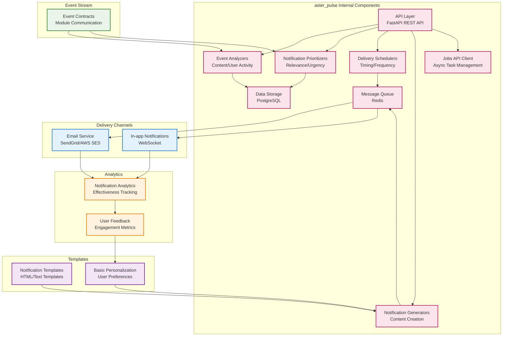

# Aster Pulse Module Specification

## 🎯 Module Overview

**aster_pulse** is the notification and proactive communication engine that keeps researchers informed about important updates, provides motivational support, and delivers timely alerts about relevant research developments. In the MVP phase, it focuses on basic notifications for the slim workflow.

### Related Specs
Related: jobs_api.md · events_and_data_contracts.md

## 🏗️ Architecture

### Core Responsibilities
- **Basic Notifications**: Deliver relevant, timely notifications about research updates
- **Simple Alerts**: Identify and notify about important developments in research areas
- **Basic Motivational Support**: Provide encouragement and wellness check-ins
- **Web-based Delivery**: Support email and in-app notifications primarily

### MVP Constraints
- **Web-First**: Focus on web-based notifications with email fallback
- **Simple Notifications**: Basic notification types without complex intelligence
- **Event-Driven**: Use event contracts for communication (see `events_and_data_contracts.md`)
- **Jobs API Integration**: Long-running notification tasks use Jobs API
- **Minimal Channels**: Email and in-app notifications only in MVP

### System Design

#### MVP Architecture Block Diagram
```
┌─────────────────┐    ┌─────────────────┐    ┌─────────────────┐
│  Event Stream   │───▶│  Pulse Core     │───▶│  Delivery       │
│                 │    │                 │    │  Channels       │
│ • Content       │    │ • Analyzers     │    │                 │
│ • User Activity │    │ • Prioritizers  │    │ • Email         │
│ • System Events │    │ • Schedulers    │    │ • In-app        │
│                 │    │ • Generators    │    │                 │
└─────────────────┘    └─────────────────┘    └─────────────────┘
                              │
                              ▼
                       ┌─────────────────┐
                       │  Pulse API      │
                       │                 │
                       │ • Notifications │
                       │ • Preferences   │
                       │ • Analytics     │
                       │ • Management    │
                       └─────────────────┘
```

#### Detailed Internal Architecture


#### External Dependencies
- **Input Events**: Content updates from aster_watcher, recommendations from aster_ranker
- **Delivery Services**: SendGrid/AWS SES for email delivery
- **Message Queue**: Redis for notification queuing and scheduling
- **WebSocket**: Real-time in-app notification delivery
- **Jobs API**: For long-running notification tasks

#### Integration Points
- **Event Consumers**: aster_gardener, aster_ranker (feedback loop)
- **Events Published**:
  - `NotificationSentEvent`: Notifications delivered to users
  - `NotificationInteractionEvent`: User interactions with notifications
  - `PreferenceUpdatedEvent`: User preference changes

## 📋 Functional Requirements

### MVP Features

#### 1. Basic Notifications
- **Content Alerts**: Notify about new papers and updates
- **Simple Citation Tracking**: Basic alerts when papers are cited
- **Author Updates**: Track and notify about updates from followed authors
- **Basic Deadline Reminders**: Simple reminders for important dates
- **User Activity Notifications**: Notify about user interactions and feedback

#### 2. Simple Intelligence
- **Basic Trend Detection**: Simple identification of emerging trends
- **Gap Alerts**: Basic notifications about research gaps
- **Simple Competitive Intelligence**: Track basic competing research
- **Basic Funding Alerts**: Simple alerts about funding opportunities
- **Conference Updates**: Basic notifications about conferences

#### 3. Basic Motivational Support
- **Simple Wellness Check-ins**: Basic check-ins on research progress
- **Achievement Recognition**: Celebrate basic milestones
- **Simple Encouragement**: Provide basic motivation messages
- **Break Reminders**: Suggest basic breaks and work-life balance
- **Simple Goal Tracking**: Basic progress monitoring

#### 4. Web-based Delivery
- **Email Notifications**: Basic HTML emails with actionable content
- **In-app Notifications**: Real-time notifications within Aster
- **Basic Personalization**: Simple user preference matching
- **Frequency Control**: Basic notification frequency control
- **Simple Filtering**: Basic content filtering

### Future Phase Features

#### 5. Advanced Notifications (Future Phase)
- **Advanced Content Alerts**: More sophisticated content analysis
- **Complex Citation Tracking**: Advanced citation network analysis
- **Author Reputation Tracking**: Track author influence and reputation
- **Advanced Deadline Management**: Complex deadline tracking and prioritization
- **Collaboration Updates**: Advanced team activity tracking

#### 6. Advanced Intelligence (Future Phase)
- **Deep Trend Detection**: Advanced trend analysis and prediction
- **Complex Gap Analysis**: Sophisticated research gap identification
- **Advanced Competitive Intelligence**: Complex competitive analysis
- **Funding Intelligence**: Advanced funding opportunity analysis
- **Conference Intelligence**: Advanced conference tracking and recommendations

#### 7. Advanced Motivational Support (Future Phase)
- **Advanced Wellness Support**: Sophisticated wellness and productivity tracking
- **Achievement Analytics**: Advanced milestone and accomplishment tracking
- **Personalized Encouragement**: AI-driven motivational messaging
- **Advanced Break Management**: Intelligent break and work-life balance
- **Goal Analytics**: Advanced goal tracking and optimization

#### 8. Multi-channel Delivery (Future Phase)
- **Slack Integration**: Direct messages and channel updates
- **Discord Integration**: Server notifications and bot interactions
- **Mobile Push**: Push notifications for mobile devices
- **Advanced Personalization**: Sophisticated user preference learning
- **Escalation Rules**: Advanced notification escalation

## 🔧 Technical Specifications

### Technology Stack
- **Framework**: FastAPI for REST API, Celery for background tasks
- **Message Queue**: Redis for notification queuing
- **Email Service**: SendGrid or AWS SES for email delivery
- **WebSocket**: Real-time in-app notifications
- **Jobs API**: Integration with Jobs API for long-running tasks

### Data Models

```python
@dataclass
class Notification:
    id: str
    user_id: str
    notification_type: str  # 'content', 'citation', 'deadline', 'wellness'
    title: str
    message: str
    priority: str  # 'low', 'medium', 'high', 'urgent'
    channels: List[str]  # 'email', 'in_app'
    metadata: Dict[str, Any]
    scheduled_for: datetime
    sent_at: Optional[datetime]
    read_at: Optional[datetime]
    status: str  # 'pending', 'sent', 'delivered', 'failed'

@dataclass
class UserNotificationPreferences:
    id: str
    user_id: str
    email_enabled: bool
    in_app_enabled: bool
    quiet_hours_start: Optional[time]
    quiet_hours_end: Optional[time]
    notification_types: Dict[str, bool]
    frequency_preferences: Dict[str, str]  # 'immediate', 'daily', 'weekly'
    priority_threshold: str  # 'low', 'medium', 'high'

@dataclass
class NotificationTemplate:
    id: str
    template_type: str
    title_template: str
    message_template: str
    variables: List[str]
    channels: List[str]
    priority: str
    is_active: bool

@dataclass
class NotificationAnalytics:
    id: str
    notification_id: str
    user_id: str
    sent_at: datetime
    delivered_at: Optional[datetime]
    read_at: Optional[datetime]
    clicked_at: Optional[datetime]
    action_taken: Optional[str]
    feedback_score: Optional[int]

@dataclass
class NotificationJob:
    job_id: str
    notification_type: str
    status: str  # 'queued', 'processing', 'completed', 'failed'
    user_count: int
    processing_time: Optional[float]
    error_message: Optional[str]
    created_at: datetime
    completed_at: Optional[datetime]
```

### API Endpoints

```python
# Notification Management
POST /api/v1/notifications
GET /api/v1/notifications/{user_id}
PUT /api/v1/notifications/{notification_id}
DELETE /api/v1/notifications/{notification_id}

# User Preferences
GET /api/v1/preferences/{user_id}
PUT /api/v1/preferences/{user_id}
POST /api/v1/preferences/{user_id}/test

# Template Management
POST /api/v1/templates
GET /api/v1/templates
PUT /api/v1/templates/{template_id}
DELETE /api/v1/templates/{template_id}

# Jobs API Integration
POST /api/v1/jobs/send-notifications
GET /api/v1/jobs/{job_id}
GET /api/v1/jobs/notification-history

# Analytics & Insights
GET /api/v1/analytics/{user_id}
GET /api/v1/analytics/effectiveness
POST /api/v1/analytics/feedback

# Batch Operations
POST /api/v1/batch/notify
POST /api/v1/batch/schedule
POST /api/v1/batch/update_preferences

# WebSocket
WS /api/v1/notifications/stream
```

## 🚀 Implementation Phases

### MVP Phase 1: Core Infrastructure (Weeks 1-2)
- Set up FastAPI application with Celery workers
- Implement database models for notifications and preferences
- Create basic notification queuing system
- Set up configuration management
- Implement Jobs API integration

### MVP Phase 2: Basic Notifications (Weeks 3-4)
- Implement basic notification generation
- Add simple content-based notifications
- Create basic citation tracking
- Build simple deadline reminder system

### MVP Phase 3: Simple Intelligence (Weeks 5-6)
- Implement basic trend detection
- Add simple gap analysis
- Create basic competitive intelligence
- Build simple funding and conference alerts

### MVP Phase 4: Web Delivery (Weeks 7-8)
- Implement email delivery system
- Add in-app notification system
- Create basic personalization
- Build simple analytics

### Future Phase 5: Advanced Notifications (Weeks 9-12)
- Implement advanced content analysis
- Add complex citation tracking
- Create advanced deadline management
- Build collaboration tracking

### Future Phase 6: Advanced Features (Weeks 13-16)
- Implement multi-channel delivery
- Add advanced personalization
- Create sophisticated analytics
- Build advanced motivational support

## 📊 Success Metrics

### MVP Metrics
- **Delivery Speed**: < 10 minutes for urgent notifications, < 2 hours for regular
- **Delivery Success**: 95%+ successful delivery rate
- **Channel Reliability**: 99% uptime for delivery channels
- **Processing Throughput**: 500+ notifications per hour
- **User Engagement**: 60%+ notification open rate

### Future Targets
- **Performance**: < 5 minutes for urgent notifications, < 1 hour for regular
- **Delivery Success**: 99%+ successful delivery rate
- **Channel Reliability**: 99.9% uptime for all delivery channels
- **Processing Throughput**: 1000+ notifications per hour
- **User Engagement**: 70%+ notification open rate

### Quality Metrics
- **Relevance Score**: 80%+ relevance accuracy
- **Timing Accuracy**: 85%+ notifications delivered at optimal times
- **Personalization**: 70%+ improvement over generic notifications
- **User Satisfaction**: 7/10+ user satisfaction with notifications

## 🔄 Integration Points

### Input Dependencies
- **aster_watcher**: New content and updates
- **aster_ranker**: High-priority content recommendations
- **aster_bloom**: User activity and interactions
- **aster_gardener**: User preference and behavior data
- **Jobs API**: For long-running notification tasks

### Output Events
```python
# Notification sent
NotificationSentEvent:
    notification_id: str
    user_id: str
    channel: str
    sent_at: datetime
    delivery_status: str

# User interaction
NotificationInteractionEvent:
    notification_id: str
    user_id: str
    action: str  # 'read', 'click', 'dismiss', 'snooze'
    timestamp: datetime

# Preference updated
PreferenceUpdatedEvent:
    user_id: str
    preference_type: str
    old_value: Any
    new_value: Any
    timestamp: datetime
```

### Downstream Consumers
- **aster_gardener**: Learn from notification interactions
- **aster_ranker**: Adjust recommendations based on notification feedback
- **aster_bloom**: Display notification history and preferences
- **Analytics System**: Track notification effectiveness and user engagement

## 🛡️ Security & Privacy

### Data Protection
- **Message Encryption**: Encrypt sensitive notification content
- **Access Control**: Secure access to notification preferences and history
- **Rate Limiting**: Prevent notification spam and abuse
- **Audit Logging**: Track all notification operations and deliveries

### Privacy Compliance
- **User Consent**: Clear consent for notification channels and types
- **Data Minimization**: Only collect necessary notification data
- **Right to Deletion**: Support complete notification history removal
- **Channel Security**: Secure integration with third-party services

## 🧪 Testing Strategy

### Unit Tests
- Notification generation logic validation
- Channel integration testing
- Preference management verification
- Template rendering accuracy

### Integration Tests
- End-to-end notification delivery workflow
- WebSocket integration testing
- External API integration validation
- Performance and load testing

### User Testing
- **Notification Timing**: Test optimal notification timing
- **Content Relevance**: Validate notification content relevance
- **Channel Preferences**: Test user channel preferences
- **Wellness Impact**: Measure impact on user well-being

## 📚 Documentation Requirements

### API Documentation
- OpenAPI specification with examples
- WebSocket integration guide
- Template creation documentation
- Analytics and reporting guide

### Operational Documentation
- Notification delivery troubleshooting
- Channel configuration guides
- Performance monitoring setup
- Backup and recovery procedures

### User Documentation
- Notification preference configuration
- Channel setup and management
- Wellness and productivity tips
- Troubleshooting common issues

## ⚠️ Risks & Mitigations

### Technical Risks
- **Email Delivery Issues**: Email services may have delivery problems
  - *Mitigation*: Implement multiple email providers and delivery monitoring
- **WebSocket Scalability**: WebSocket connections may not scale to many users
  - *Mitigation*: Implement connection pooling and consider server-sent events
- **Notification Spam**: Users may receive too many notifications
  - *Mitigation*: Implement intelligent frequency control and user feedback

### Operational Risks
- **User Fatigue**: Too many notifications may lead to user fatigue
  - *Mitigation*: Implement smart frequency control and personalization
- **Relevance Issues**: Notifications may not be relevant to users
  - *Mitigation*: Implement relevance scoring and user feedback mechanisms
- **Timing Problems**: Notifications may be sent at inappropriate times
  - *Mitigation*: Implement quiet hours and user preference learning

## ❓ Open Questions

### Technical Questions
- What is the optimal notification frequency for different user types?
- How should we handle notification failures and retries?
- What is the best approach for real-time notification delivery?
- How should we balance notification relevance vs. frequency?

### Product Questions
- What types of notifications are most valuable for researchers?
- How should we handle users with different notification preferences?
- What level of personalization is optimal for notifications?
- How should we measure notification success beyond open rates?

### Integration Questions
- How should we coordinate notifications across multiple modules?
- What is the optimal event schema for notification triggers?
- How should we handle notification conflicts and prioritization?
- What is the best approach for handling notification history?

---

*This specification provides the foundation for building the aster_pulse module as a separate project. The module will be developed independently and integrated with the broader Aster ecosystem through well-defined APIs and event contracts, starting with an MVP focus on basic web-based notifications.*
