# Aster Scribe Module Specification

## 🎯 Module Overview

**aster_scribe** is the research writing assistant that helps researchers draft, revise, and compile academic documents. It provides intelligent writing support, citation management, and LaTeX integration to streamline the research writing process.

### Related Specs
Related: jobs_api.md · events_and_data_contracts.md

## 🏗️ Architecture

### Core Responsibilities
- **Writing Assistance**: AI-powered writing support for academic content
- **Citation Management**: Automatic citation generation and reference management
- **LaTeX Integration**: Seamless LaTeX document compilation and formatting
- **Collaborative Writing**: Support for team-based document creation and editing

### System Design

#### Original ASCII Block Diagram
```
┌─────────────────┐    ┌─────────────────┐    ┌─────────────────┐
│  Content &      │───▶│  Scribe Core    │───▶│  Document Store │
│  User Input     │    │                 │    │                 │
│                 │    │ • Writers       │    │ • Database      │
│ • Research      │    │ • Editors       │    │ • File Storage  │
│ • Outlines      │    │ • Compilers     │    │ • Version       │
│ • Citations     │    │ • Collaborators │    │   Control       │
└─────────────────┘    └─────────────────┘    └─────────────────┘
                              │
                              ▼
                       ┌─────────────────┐
                       │  Scribe API     │
                       │                 │
                       │ • Writing       │
                       │ • Citations     │
                       │ • LaTeX         │
                       │ • Collaboration │
                       └─────────────────┘
```

#### Detailed Internal Architecture

```mermaid
graph TB
    subgraph "aster_scribe Internal Components"
        api[API Layer<br/>FastAPI REST API]
        writers[AI Writers<br/>GPT-4/Claude]
        editors[Document Editors<br/>Revision/Improvement]
        compilers[LaTeX Compilers<br/>Document Generation]
        collaborators[Collaboration Engine<br/>Real-time Editing]
        storage[Data Storage<br/>PostgreSQL]
        cache[Cache Layer<br/>Redis]
    end

    subgraph "AI Models"
        gpt4[OpenAI GPT-4<br/>Content Generation]
        claude[Anthropic Claude<br/>Writing Assistance]
        local[Local LLMs<br/>Specialized Tasks]
    end

    subgraph "LaTeX Engine"
        miktex[MiKTeX<br/>LaTeX Compilation]
        texlive[TeX Live<br/>Alternative Engine]
        bibtex[BibTeX<br/>Bibliography]
    end

    subgraph "Version Control"
        git[Git Integration<br/>Document Versioning]
        websocket[WebSocket<br/>Real-time Collaboration]
    end

    subgraph "File Storage"
        s3[S3-Compatible<br/>Document Files]
        templates[LaTeX Templates<br/>Document Templates]
    end

    %% Internal flow
    api --> writers
    api --> editors
    api --> compilers
    api --> collaborators

    writers --> storage
    editors --> storage
    compilers --> storage
    collaborators --> storage

    storage --> cache

    %% AI model integration
    gpt4 --> writers
    claude --> writers
    local --> editors

    %% LaTeX integration
    miktex --> compilers
    texlive --> compilers
    bibtex --> compilers

    %% Version control
    git --> collaborators
    websocket --> collaborators

    %% File storage
    s3 --> compilers
    templates --> compilers

    %% Styling
    classDef internal fill:#fff3e0,stroke:#f57c00,stroke-width:2px
    classDef ai fill:#fce4ec,stroke:#c2185b,stroke-width:2px
    classDef latex fill:#e8f5e8,stroke:#2e7d32,stroke-width:2px
    classDef version fill:#f3e5f5,stroke:#7b1fa2,stroke-width:2px
    classDef storage fill:#e1f5fe,stroke:#01579b,stroke-width:2px

    class api,writers,editors,compilers,collaborators,storage,cache internal
    class gpt4,claude,local ai
    class miktex,texlive,bibtex latex
    class git,websocket version
    class s3,templates storage
```


#### External Dependencies
- **Input Data**: Research content from aster_indexer, validated references from aster_verifier
- **AI Models**: OpenAI GPT-4, Claude for writing assistance and content generation
- **LaTeX Engine**: MiKTeX or TeX Live for document compilation
- **Version Control**: Git integration for document versioning and collaboration

#### Integration Points
- **Event Consumers**: aster_alchemist, aster_visualizer
- **Events Published**:
  - `DocumentCreatedEvent`: New documents created
  - `CitationUpdatedEvent`: Citation changes and updates
  - `CollaborationEvent`: Real-time collaboration activities

## 📋 Functional Requirements

### 1. Writing Assistance
- **Content Generation**: Generate initial drafts based on research outlines
- **Section Writing**: Assist with specific sections (introduction, methods, etc.)
- **Revision Support**: Suggest improvements and alternative phrasings
- **Style Adaptation**: Adapt writing style to different venues and audiences
- **Grammar & Clarity**: Check grammar, clarity, and academic writing standards

### 2. Citation Management
- **Automatic Citations**: Generate citations from content references
- **Reference Validation**: Verify and validate reference information
- **Citation Styles**: Support multiple citation formats (APA, IEEE, etc.)
- **Bibliography Generation**: Create formatted bibliographies
- **Citation Tracking**: Track citation usage and completeness

### 3. LaTeX Integration
- **Document Compilation**: Compile LaTeX documents with proper formatting
- **Template Management**: Provide and manage LaTeX templates
- **Figure Integration**: Handle figure placement and captioning
- **Table Generation**: Create and format tables from data
- **Bibliography Integration**: Integrate with BibTeX for references

### 4. Collaborative Features
- **Version Control**: Track document versions and changes
- **Comment System**: Support inline comments and suggestions
- **Review Workflow**: Facilitate document review and approval
- **Conflict Resolution**: Handle concurrent editing conflicts
- **Permission Management**: Control access and editing permissions

### 5. Research Integration
- **Content Linking**: Link writing to research content and notes
- **Evidence Integration**: Incorporate research findings and data
- **Gap Analysis**: Identify missing content or references
- **Consistency Checking**: Ensure consistency across document sections
- **Progress Tracking**: Track writing progress and completion

## 🔧 Technical Specifications

### Technology Stack
- **Framework**: FastAPI for REST API, Celery for background processing
- **AI Models**: OpenAI GPT-4, Claude for writing assistance
- **LaTeX Engine**: MiKTeX or TeX Live for document compilation
- **Database**: PostgreSQL for documents, Redis for caching
- **Version Control**: Git integration for document versioning
- **File Storage**: S3-compatible storage for document files
- **Collaboration**: WebSocket for real-time collaboration

### Data Models

```python
@dataclass
class Document:
    id: str
    user_id: str
    title: str
    document_type: str  # 'paper', 'thesis', 'proposal', 'report'
    content: str
    metadata: Dict[str, Any]
    version: int
    status: str  # 'draft', 'review', 'final', 'published'
    collaborators: List[str]
    created_at: datetime
    updated_at: datetime

@dataclass
class Citation:
    id: str
    document_id: str
    citation_key: str
    reference_type: str  # 'paper', 'book', 'website', 'dataset'
    title: str
    authors: List[str]
    publication_info: Dict[str, Any]
    url: Optional[str]
    doi: Optional[str]
    citation_style: str  # 'apa', 'ieee', 'mla', 'chicago'
    usage_count: int

@dataclass
class WritingSession:
    id: str
    user_id: str
    document_id: str
    session_type: str  # 'writing', 'editing', 'reviewing'
    start_time: datetime
    end_time: Optional[datetime]
    word_count: int
    changes_made: List[str]
    ai_assistance_used: bool

@dataclass
class LaTeXTemplate:
    id: str
    name: str
    template_type: str  # 'conference', 'journal', 'thesis', 'proposal'
    content: str
    variables: List[str]
    is_active: bool
    created_at: datetime
```

### API Endpoints

```python
# Document Management
POST /api/v1/documents
GET /api/v1/documents
GET /api/v1/documents/{document_id}
PUT /api/v1/documents/{document_id}
DELETE /api/v1/documents/{document_id}

# Writing Assistance
POST /api/v1/writing/generate
POST /api/v1/writing/revise
POST /api/v1/writing/suggest
GET /api/v1/writing/feedback/{document_id}

# Citation Management
POST /api/v1/citations
GET /api/v1/citations/{document_id}
PUT /api/v1/citations/{citation_id}
DELETE /api/v1/citations/{citation_id}
POST /api/v1/citations/generate_bibliography

# LaTeX Operations
POST /api/v1/latex/compile
GET /api/v1/latex/templates
POST /api/v1/latex/templates
PUT /api/v1/latex/templates/{template_id}
DELETE /api/v1/latex/templates/{template_id}

# Collaboration
POST /api/v1/collaboration/invite
GET /api/v1/collaboration/{document_id}/users
PUT /api/v1/collaboration/{document_id}/permissions
POST /api/v1/collaboration/{document_id}/comments

# Version Control
GET /api/v1/versions/{document_id}
POST /api/v1/versions/{document_id}/commit
GET /api/v1/versions/{document_id}/history
POST /api/v1/versions/{document_id}/revert

# Export & Integration
POST /api/v1/export/{document_id}
GET /api/v1/export/formats
POST /api/v1/integrations/overleaf
GET /api/v1/integrations/status
```

## 🚀 Implementation Phases

### Phase 1: Core Infrastructure (Weeks 1-2)
- Set up FastAPI application with Celery workers
- Implement database models for documents and citations
- Create basic document management system
- Set up LaTeX compilation environment

### Phase 2: Writing Assistance (Weeks 3-4)
- Implement AI-powered writing assistance
- Add content generation capabilities
- Create revision and suggestion system
- Build grammar and style checking

### Phase 3: Citation & LaTeX (Weeks 5-6)
- Implement citation management system
- Add LaTeX template management
- Create bibliography generation
- Build document compilation pipeline

### Phase 4: Collaboration & Integration (Weeks 7-8)
- Implement collaborative editing features
- Add version control system
- Create real-time collaboration
- Build integration with other Aster modules

## 📊 Success Metrics

### Performance Metrics
- **Writing Speed**: 50%+ improvement in writing productivity
- **Compilation Time**: < 30 seconds for LaTeX document compilation
- **Citation Accuracy**: 95%+ accuracy in citation generation
- **Collaboration Efficiency**: 40%+ reduction in review cycles

### Quality Metrics
- **Writing Quality**: 85%+ satisfaction with AI writing assistance
- **Citation Completeness**: 90%+ complete and accurate citations
- **Document Consistency**: 95%+ consistency across document sections
- **User Adoption**: 80%+ of users use writing assistance features

### User Experience Metrics
- **Ease of Use**: 9/10+ usability score
- **Feature Adoption**: 70%+ adoption of collaborative features
- **Time Savings**: 30%+ time savings in document creation
- **Error Reduction**: 60%+ reduction in citation and formatting errors

## 🔄 Integration Points

### Input Dependencies
- **aster_indexer**: Research content and references
- **aster_digestor**: Content summaries and insights
- **aster_ranker**: Relevant content recommendations
- **aster_verifier**: Reference validation and verification
- **aster_bloom**: User interface and document management

### Output Events
```python
# Document created/updated
DocumentEvent:
    document_id: str
    user_id: str
    action: str  # 'created', 'updated', 'published'
    version: int
    word_count: int
    timestamp: datetime

# Citation added
CitationEvent:
    citation_id: str
    document_id: str
    citation_key: str
    reference_type: str
    action: str  # 'added', 'updated', 'removed'

# Writing session
WritingSessionEvent:
    session_id: str
    user_id: str
    document_id: str
    duration: int
    word_count_change: int
    ai_assistance_used: bool
```

### Downstream Consumers
- **aster_bloom**: Display documents and writing progress
- **aster_pulse**: Send writing reminders and progress updates
- **aster_gardener**: Learn from writing patterns and preferences
- **aster_verifier**: Validate citations and references

## 🛡️ Security & Privacy

### Data Protection
- **Document Encryption**: Encrypt sensitive document content
- **Access Control**: Granular permissions for document access
- **Version Security**: Secure version control and change tracking
- **Collaboration Security**: Secure real-time collaboration features

### Privacy Compliance
- **User Consent**: Clear consent for AI writing assistance
- **Data Minimization**: Only process necessary document content
- **Right to Deletion**: Support complete document removal
- **Collaboration Privacy**: Respect user privacy in collaborative settings

## 🧪 Testing Strategy

### Unit Tests
- Writing assistance algorithm validation
- Citation generation accuracy testing
- LaTeX compilation verification
- Collaboration feature testing

### Integration Tests
- End-to-end document creation workflow
- AI model integration testing
- LaTeX template system validation
- Real-time collaboration testing

### User Testing
- **Writing Quality**: Test AI writing assistance quality
- **Usability**: Test document management interface
- **Collaboration**: Test collaborative editing features
- **Performance**: Test LaTeX compilation performance

## 📚 Documentation Requirements

### API Documentation
- OpenAPI specification with examples
- Writing assistance API guide
- Citation management documentation
- LaTeX integration guide

### User Documentation
- Writing assistance usage guide
- Citation management tutorial
- LaTeX template creation guide
- Collaboration features walkthrough

### Developer Documentation
- AI model integration guide
- LaTeX compilation setup
- Collaboration system architecture
- Performance optimization guide

---

*This specification provides the foundation for building the aster_scribe module as a separate project. The module will be developed independently and integrated with the broader Aster ecosystem through well-defined APIs and event contracts.*
