# Aster Tutor Module Specification

## 🎯 Module Overview

**aster_tutor** is the educational content generation engine that creates study aids, flashcards, quizzes, and learning materials from academic content. It helps researchers and students learn more effectively by transforming research papers and concepts into digestible educational content.

### Related Specs
Related: jobs_api.md · events_and_data_contracts.md

## 🏗️ Architecture

### Core Responsibilities
- **Study Aid Generation**: Create flashcards, summaries, and study guides
- **Quiz Generation**: Generate quizzes and assessments from content
- **Learning Path Creation**: Create structured learning paths and curricula
- **Educational Content Adaptation**: Adapt content for different learning levels

### System Design

#### Original ASCII Block Diagram
```
┌─────────────────┐    ┌─────────────────┐    ┌─────────────────┐
│  Academic       │───▶│  Tutor Core     │───▶│  Learning Store │
│  Content        │    │                 │    │                 │
│                 │    │ • Generators    │    │ • Database      │
│ • Papers        │    │ • Adapters      │    │ • File Storage  │
│ • Concepts      │    │ • Assessors     │    │ • Progress      │
│ • Topics        │    │ • Path Builders │    │   Tracking      │
└─────────────────┘    └─────────────────┘    └─────────────────┘
                              │
                              ▼
                       ┌─────────────────┐
                       │  Tutor API      │
                       │                 │
                       │ • Study Aids    │
                       │ • Quizzes       │
                       │ • Learning      │
                       │ • Progress      │
                       └─────────────────┘
```

#### Detailed Internal Architecture

```mermaid
graph TB
    subgraph "aster_tutor Internal Components"
        api[API Layer<br/>FastAPI REST API]
        generators[Content Generators<br/>Study Aids/Quizzes]
        adapters[Content Adapters<br/>Level/Language Adaptation]
        assessors[Learning Assessors<br/>Progress/Performance]
        pathbuilders[Learning Path Builders<br/>Curriculum Design]
        storage[Data Storage<br/>PostgreSQL]
        cache[Cache Layer<br/>Redis]
    end

    subgraph "AI Models"
        gpt4[OpenAI GPT-4<br/>Content Generation]
        claude[Anthropic Claude<br/>Educational Content]
        local[Local LLMs<br/>Specialized Tasks]
    end

    subgraph "NLP Processing"
        spacy[spaCy<br/>Text Processing]
        nltk[NLTK<br/>Natural Language]
    end

    subgraph "Assessment Engine"
        quizengine[Quiz Engine<br/>Question Generation]
        analytics[Learning Analytics<br/>Progress Tracking]
        gamification[Achievement System<br/>Gamification]
    end

    subgraph "Visualization"
        matplotlib[Matplotlib<br/>Learning Analytics]
        plotly[Plotly<br/>Interactive Charts]
    end

    subgraph "ML Libraries"
        sklearn[scikit-learn<br/>Learning Analytics]
    end

    %% Internal flow
    api --> generators
    api --> adapters
    api --> assessors
    api --> pathbuilders

    generators --> storage
    adapters --> storage
    assessors --> storage
    pathbuilders --> storage

    storage --> cache

    %% AI model integration
    gpt4 --> generators
    claude --> generators
    local --> adapters

    %% NLP integration
    spacy --> generators
    nltk --> generators

    %% Assessment engine
    quizengine --> assessors
    analytics --> assessors
    gamification --> assessors

    %% Visualization
    matplotlib --> analytics
    plotly --> analytics

    %% ML integration
    sklearn --> analytics

    %% Styling
    classDef internal fill:#e1f5fe,stroke:#01579b,stroke-width:2px
    classDef ai fill:#fce4ec,stroke:#c2185b,stroke-width:2px
    classDef nlp fill:#f3e5f5,stroke:#7b1fa2,stroke-width:2px
    classDef assessment fill:#e8f5e8,stroke:#2e7d32,stroke-width:2px
    classDef viz fill:#fff3e0,stroke:#f57c00,stroke-width:2px
    classDef ml fill:#f9fbe7,stroke:#827717,stroke-width:2px

    class api,generators,adapters,assessors,pathbuilders,storage,cache internal
    class gpt4,claude,local ai
    class spacy,nltk nlp
    class quizengine,analytics,gamification assessment
    class matplotlib,plotly viz
    class sklearn ml
```


#### External Dependencies
- **Input Data**: Academic content from aster_indexer, summaries from aster_digestor
- **AI Models**: OpenAI GPT-4, Claude for educational content generation
- **NLP Libraries**: spaCy, NLTK for text processing and analysis
- **ML Libraries**: scikit-learn for learning analytics and assessment

#### Integration Points
- **Event Consumers**: aster_bloom, aster_pulse
- **Events Published**:
  - `StudyAidGeneratedEvent`: New study aids created
  - `QuizCompletedEvent`: Quiz completion and results
  - `LearningProgressEvent`: Learning progress updates

## 📋 Functional Requirements

### 1. Study Aid Generation
- **Flashcard Creation**: Generate flashcards from key concepts and definitions
- **Summary Generation**: Create concise summaries for different learning levels
- **Concept Maps**: Generate visual concept maps and mind maps
- **Study Guides**: Create comprehensive study guides for topics
- **Glossary Generation**: Extract and define key terms and concepts

### 2. Quiz Generation
- **Multiple Choice Questions**: Generate multiple choice questions from content
- **True/False Questions**: Create true/false questions for concept verification
- **Fill-in-the-Blank**: Generate fill-in-the-blank questions
- **Matching Questions**: Create matching questions for related concepts
- **Difficulty Adaptation**: Adapt question difficulty to user level

### 3. Learning Path Creation
- **Curriculum Design**: Design structured learning curricula
- **Prerequisite Mapping**: Identify and map learning prerequisites
- **Progressive Learning**: Create progressive learning sequences
- **Adaptive Paths**: Adapt learning paths based on user progress
- **Topic Sequencing**: Sequence topics for optimal learning

### 4. Educational Content Adaptation
- **Level Adaptation**: Adapt content for different expertise levels
- **Learning Style Adaptation**: Adapt to different learning styles
- **Language Adaptation**: Adapt content for different languages
- **Format Adaptation**: Adapt content for different formats (text, audio, video)
- **Accessibility Adaptation**: Ensure content accessibility

### 5. Progress Tracking & Assessment
- **Learning Progress**: Track user learning progress and achievements
- **Performance Analytics**: Analyze quiz performance and learning patterns
- **Gap Identification**: Identify knowledge gaps and areas for improvement
- **Recommendation Engine**: Recommend next learning steps
- **Achievement System**: Implement gamification and achievement tracking

## 🔧 Technical Specifications

### Technology Stack
- **Framework**: FastAPI for REST API, Celery for background processing
- **AI Models**: OpenAI GPT-4, Claude for content generation
- **NLP Libraries**: spaCy, NLTK for text processing
- **Database**: PostgreSQL for learning data, Redis for caching
- **ML Libraries**: scikit-learn for learning analytics
- **Visualization**: Matplotlib, Plotly for learning analytics
- **Assessment Engine**: Custom assessment and quiz engine

### Data Models

```python
@dataclass
class StudyAid:
    id: str
    content_id: str
    aid_type: str  # 'flashcard', 'summary', 'concept_map', 'study_guide'
    title: str
    content: str
    difficulty_level: str  # 'beginner', 'intermediate', 'advanced'
    learning_objectives: List[str]
    estimated_time: int  # minutes
    created_at: datetime
    metadata: Dict[str, Any]

@dataclass
class Quiz:
    id: str
    content_id: str
    quiz_type: str  # 'multiple_choice', 'true_false', 'fill_blank', 'matching'
    title: str
    questions: List[Question]
    difficulty_level: str
    time_limit: Optional[int]  # minutes
    passing_score: float
    created_at: datetime

@dataclass
class Question:
    id: str
    question_text: str
    question_type: str
    options: List[str]  # for multiple choice
    correct_answer: str
    explanation: str
    difficulty: str
    tags: List[str]

@dataclass
class LearningPath:
    id: str
    title: str
    description: str
    target_audience: str
    difficulty_level: str
    modules: List[LearningModule]
    prerequisites: List[str]
    estimated_duration: int  # hours
    learning_objectives: List[str]
    created_at: datetime

@dataclass
class LearningModule:
    id: str
    title: str
    content_ids: List[str]
    study_aids: List[str]
    quizzes: List[str]
    order: int
    estimated_time: int  # minutes
    learning_objectives: List[str]

@dataclass
class UserProgress:
    id: str
    user_id: str
    content_id: str
    progress_type: str  # 'study_aid', 'quiz', 'learning_path'
    completion_percentage: float
    time_spent: int  # minutes
    performance_score: Optional[float]
    last_accessed: datetime
    completed_at: Optional[datetime]
```

### API Endpoints

```python
# Study Aid Management
POST /api/v1/study_aids/generate
GET /api/v1/study_aids/{content_id}
PUT /api/v1/study_aids/{aid_id}
DELETE /api/v1/study_aids/{aid_id}
POST /api/v1/study_aids/batch_generate

# Quiz Management
POST /api/v1/quizzes/generate
GET /api/v1/quizzes/{content_id}
PUT /api/v1/quizzes/{quiz_id}
DELETE /api/v1/quizzes/{quiz_id}
POST /api/v1/quizzes/{quiz_id}/take

# Learning Path Management
POST /api/v1/learning_paths/create
GET /api/v1/learning_paths
GET /api/v1/learning_paths/{path_id}
PUT /api/v1/learning_paths/{path_id}
DELETE /api/v1/learning_paths/{path_id}

# Progress Tracking
POST /api/v1/progress/track
GET /api/v1/progress/{user_id}
PUT /api/v1/progress/{progress_id}
GET /api/v1/progress/{user_id}/analytics
POST /api/v1/progress/{user_id}/recommendations

# Assessment & Analytics
POST /api/v1/assessment/evaluate
GET /api/v1/assessment/{user_id}/performance
POST /api/v1/assessment/gap_analysis
GET /api/v1/assessment/{user_id}/achievements

# Content Adaptation
POST /api/v1/adaptation/adapt_content
GET /api/v1/adaptation/levels
POST /api/v1/adaptation/learning_style
GET /api/v1/adaptation/formats

# Export & Integration
POST /api/v1/export/study_materials
GET /api/v1/export/formats
POST /api/v1/integrations/learning_platform
GET /api/v1/integrations/status
```

## 🚀 Implementation Phases

### Phase 1: Core Infrastructure (Weeks 1-2)
- Set up FastAPI application with Celery workers
- Implement database models for study aids and learning data
- Create basic content generation framework
- Set up progress tracking system

### Phase 2: Study Aid Generation (Weeks 3-4)
- Implement flashcard generation from content
- Add summary and study guide creation
- Create concept map generation
- Build glossary extraction system

### Phase 3: Quiz & Assessment (Weeks 5-6)
- Implement quiz generation algorithms
- Add multiple question types
- Create assessment and evaluation system
- Build performance analytics

### Phase 4: Learning Paths & Adaptation (Weeks 7-8)
- Implement learning path creation
- Add content adaptation features
- Create recommendation engine
- Build export and integration capabilities

## 📊 Success Metrics

### Performance Metrics
- **Generation Speed**: < 30 seconds for study aid generation
- **Quiz Creation**: < 2 minutes for quiz generation
- **Progress Tracking**: Real-time progress updates
- **Assessment Speed**: < 10 seconds for quiz evaluation

### Quality Metrics
- **Content Accuracy**: 95%+ accuracy in generated content
- **Educational Value**: 90%+ user satisfaction with study materials
- **Difficulty Adaptation**: 85%+ appropriate difficulty levels
- **Learning Effectiveness**: Measurable improvement in learning outcomes

### User Experience Metrics
- **Engagement Rate**: 80%+ engagement with study materials
- **Completion Rate**: 70%+ completion rate for learning paths
- **User Satisfaction**: 9/10+ satisfaction with educational content
- **Learning Progress**: 60%+ improvement in knowledge retention

## 🔄 Integration Points

### Input Dependencies
- **aster_indexer**: Processed academic content
- **aster_digestor**: Content summaries and insights
- **aster_ranker**: Relevant content recommendations
- **aster_gardener**: User learning preferences and behavior
- **aster_bloom**: User interface for learning materials

### Output Events
```python
# Study aid generated
StudyAidGeneratedEvent:
    aid_id: str
    content_id: str
    aid_type: str
    difficulty_level: str
    generation_time: float
    quality_score: float

# Quiz completed
QuizCompletedEvent:
    quiz_id: str
    user_id: str
    score: float
    time_taken: int
    questions_answered: int
    performance_metrics: Dict[str, Any]

# Learning progress updated
ProgressUpdatedEvent:
    user_id: str
    content_id: str
    progress_type: str
    completion_percentage: float
    time_spent: int
    performance_score: Optional[float]
```

### Downstream Consumers
- **aster_bloom**: Display study materials and learning progress
- **aster_pulse**: Send learning reminders and progress notifications
- **aster_gardener**: Learn from user learning patterns
- **aster_ranker**: Adjust recommendations based on learning progress

## 🛡️ Security & Privacy

### Data Protection
- **Learning Data Encryption**: Encrypt sensitive learning data
- **Access Control**: Secure access to learning materials and progress
- **Progress Privacy**: Protect user learning progress and performance
- **Content Security**: Ensure educational content security

### Privacy Compliance
- **User Consent**: Clear consent for learning data collection
- **Data Minimization**: Only collect necessary learning data
- **Right to Deletion**: Support complete learning data removal
- **Progress Transparency**: Provide clear learning progress reports

## 🧪 Testing Strategy

### Unit Tests
- Study aid generation accuracy testing
- Quiz generation algorithm validation
- Progress tracking verification
- Content adaptation testing

### Integration Tests
- End-to-end learning workflow testing
- AI model integration validation
- Progress analytics testing
- Export and integration verification

### User Testing
- **Learning Effectiveness**: Test learning outcome improvements
- **Usability**: Test study material interface and usability
- **Engagement**: Test user engagement with learning materials
- **Accessibility**: Test accessibility of educational content

## 📚 Documentation Requirements

### API Documentation
- OpenAPI specification with examples
- Study aid generation API guide
- Quiz creation documentation
- Progress tracking API guide

### User Documentation
- Study material usage guide
- Learning path navigation tutorial
- Quiz taking and assessment guide
- Progress tracking and analytics guide

### Developer Documentation
- AI model integration guide
- Content generation algorithm documentation
- Progress tracking implementation
- Performance optimization guide

---

*This specification provides the foundation for building the aster_tutor module as a separate project. The module will be developed independently and integrated with the broader Aster ecosystem through well-defined APIs and event contracts.*
