# Aster Verifier Module Specification

## 🎯 Module Overview

**aster_verifier** is the reference validation and citation auditing engine that ensures the integrity, accuracy, and reliability of academic references. It checks for retractions, validates citations, and maintains the quality of the research knowledge base.

### Related Specs
Related: jobs_api.md · events_and_data_contracts.md

## 🏗️ Architecture

### Core Responsibilities
- **Reference Validation**: Verify the accuracy and completeness of citations
- **Retraction Detection**: Identify retracted papers and problematic references
- **Citation Auditing**: Audit citation quality and consistency
- **Integrity Monitoring**: Monitor the integrity of the research knowledge base

### System Design

#### Original ASCII Block Diagram
```
┌─────────────────┐    ┌─────────────────┐    ┌─────────────────┐
│  Reference      │───▶│  Verifier Core  │───▶│  Validation     │
│  Data Sources   │    │                 │    │  Store          │
│                 │    │ • Validators    │    │                 │
│ • Papers        │    │ • Auditors      │    │ • Database      │
│ • Citations     │    │ • Monitors      │    │ • Cache         │
│ • Retractions   │    │ • Reporters     │    │ • Alerts        │
└─────────────────┘    └─────────────────┘    └─────────────────┘
                              │
                              ▼
                       ┌─────────────────┐
                       │  Verifier API   │
                       │                 │
                       │ • Validation    │
                       │ • Auditing      │
                       │ • Monitoring    │
                       │ • Reporting     │
                       └─────────────────┘
```

#### Detailed Internal Architecture

```mermaid
graph TB
    subgraph "aster_verifier Internal Components"
        api[API Layer<br/>FastAPI REST API]
        validators[Reference Validators<br/>Citation/DOI/Author Verification]
        auditors[Citation Auditors<br/>Quality/Consistency Checking]
        monitors[Integrity Monitors<br/>Retraction/Anomaly Detection]
        reporters[Validation Reporters<br/>Reports/Alerts Generation]
        storage[Data Storage<br/>PostgreSQL]
        cache[Cache Layer<br/>Redis]
    end

    subgraph "External APIs"
        crossref[CrossRef<br/>DOI Resolution]
        pubmed[PubMed<br/>Medical Literature]
        arxiv[arXiv<br/>Preprint Validation]
        retractionwatch[Retraction Watch<br/>Retraction Database]
    end

    subgraph "ML Libraries"
        sklearn[scikit-learn<br/>Anomaly Detection]
    end

    subgraph "Analytics"
        pandas[Pandas<br/>Data Analysis]
        numpy[NumPy<br/>Statistical Analysis]
    end

    subgraph "Monitoring"
        prometheus[Prometheus<br/>System Monitoring]
        grafana[Grafana<br/>Dashboard]
    end

    subgraph "Alerting"
        alerts[Alert System<br/>Multi-channel Alerts]
    end

    %% Internal flow
    api --> validators
    api --> auditors
    api --> monitors
    api --> reporters

    validators --> storage
    auditors --> storage
    monitors --> storage
    reporters --> storage

    storage --> cache

    %% External API integration
    crossref --> validators
    pubmed --> validators
    arxiv --> validators
    retractionwatch --> monitors

    %% ML integration
    sklearn --> monitors

    %% Analytics integration
    pandas --> auditors
    numpy --> auditors

    %% Monitoring integration
    prometheus --> monitors
    grafana --> reporters

    %% Alerting integration
    alerts --> reporters

    %% Styling
    classDef internal fill:#f3e5f5,stroke:#7b1fa2,stroke-width:2px
    classDef external fill:#e3f2fd,stroke:#1976d2,stroke-width:2px
    classDef ml fill:#fce4ec,stroke:#c2185b,stroke-width:2px
    classDef analytics fill:#e8f5e8,stroke:#2e7d32,stroke-width:2px
    classDef monitoring fill:#fff3e0,stroke:#f57c00,stroke-width:2px
    classDef alerting fill:#f9fbe7,stroke:#827717,stroke-width:2px

    class api,validators,auditors,monitors,reporters,storage,cache internal
    class crossref,pubmed,arxiv,retractionwatch external
    class sklearn ml
    class pandas,numpy analytics
    class prometheus,grafana monitoring
    class alerts alerting
```


#### External Dependencies
- **Input Data**: References from aster_indexer, citations from aster_scribe
- **External APIs**: CrossRef, PubMed, arXiv, Retraction Watch for validation
- **ML Libraries**: scikit-learn for anomaly detection and pattern recognition
- **Analytics**: Pandas, NumPy for data analysis and statistical validation

#### Integration Points
- **Event Consumers**: aster_mapper, aster_scribe
- **Events Published**:
  - `ReferenceValidatedEvent`: Reference validation completed
  - `RetractionDetectedEvent`: Paper retractions identified
  - `CitationAuditEvent`: Citation audit results

## 📋 Functional Requirements

### 1. Reference Validation
- **Citation Accuracy**: Verify citation details against source databases
- **DOI Validation**: Validate DOI links and resolve to correct papers
- **Author Verification**: Verify author names and affiliations
- **Publication Verification**: Confirm publication details and dates
- **Metadata Completeness**: Check for missing or incomplete metadata

### 2. Retraction Detection
- **Retraction Database Monitoring**: Monitor retraction databases and notices
- **Paper Status Tracking**: Track the current status of papers (published, retracted, corrected)
- **Retraction Reason Analysis**: Analyze reasons for retractions
- **Impact Assessment**: Assess the impact of retractions on citing papers
- **Notification System**: Alert users about retracted papers they've referenced

### 3. Citation Auditing
- **Citation Quality Scoring**: Score citations based on completeness and accuracy
- **Consistency Checking**: Check citation consistency across documents
- **Duplicate Detection**: Identify and flag duplicate citations
- **Format Validation**: Validate citation formats and styles
- **Cross-reference Verification**: Verify cross-references between documents

### 4. Integrity Monitoring
- **Data Quality Monitoring**: Monitor the quality of reference data
- **Anomaly Detection**: Detect anomalies in citation patterns
- **Trend Analysis**: Analyze trends in citation quality and retractions
- **Compliance Checking**: Check compliance with citation standards
- **Audit Trail**: Maintain audit trails for all verification activities

### 5. Reporting & Alerts
- **Validation Reports**: Generate comprehensive validation reports
- **Quality Metrics**: Provide quality metrics for reference databases
- **Alert System**: Send alerts for critical issues and retractions
- **Dashboard Integration**: Integrate with dashboards for monitoring
- **Export Capabilities**: Export validation results and reports

## 🔧 Technical Specifications

### Technology Stack
- **Framework**: FastAPI for REST API, Celery for background processing
- **Database**: PostgreSQL for validation data, Redis for caching
- **External APIs**: CrossRef, PubMed, arXiv, Retraction Watch
- **ML Libraries**: scikit-learn for anomaly detection
- **Analytics**: Pandas, NumPy for data analysis
- **Monitoring**: Prometheus, Grafana for system monitoring
- **Alerting**: Custom alerting system with multiple channels

### Data Models

```python
@dataclass
class ReferenceValidation:
    id: str
    reference_id: str
    validation_type: str  # 'citation', 'doi', 'author', 'publication'
    status: str  # 'valid', 'invalid', 'warning', 'error'
    confidence: float  # 0-1 confidence score
    issues: List[str]
    corrections: List[str]
    validated_at: datetime
    validator_version: str

@dataclass
class RetractionRecord:
    id: str
    paper_id: str
    retraction_date: datetime
    retraction_reason: str
    retraction_type: str  # 'full', 'partial', 'correction'
    retraction_source: str
    impact_assessment: Dict[str, Any]
    affected_citations: List[str]
    created_at: datetime

@dataclass
class CitationAudit:
    id: str
    document_id: str
    audit_type: str  # 'quality', 'consistency', 'completeness'
    overall_score: float
    component_scores: Dict[str, float]
    issues_found: List[str]
    recommendations: List[str]
    audited_at: datetime
    auditor_version: str

@dataclass
class IntegrityAlert:
    id: str
    alert_type: str  # 'retraction', 'validation_error', 'anomaly'
    severity: str  # 'low', 'medium', 'high', 'critical'
    title: str
    description: str
    affected_entities: List[str]
    recommended_actions: List[str]
    created_at: datetime
    acknowledged_at: Optional[datetime]
```

### API Endpoints

```python
# Reference Validation
POST /api/v1/validation/validate
GET /api/v1/validation/{reference_id}
POST /api/v1/validation/batch
GET /api/v1/validation/status/{validation_id}

# Retraction Management
POST /api/v1/retractions/check
GET /api/v1/retractions/{paper_id}
GET /api/v1/retractions/recent
POST /api/v1/retractions/impact
GET /api/v1/retractions/statistics

# Citation Auditing
POST /api/v1/audit/audit_document
GET /api/v1/audit/{document_id}
POST /api/v1/audit/quality_score
GET /api/v1/audit/consistency_check
POST /api/v1/audit/duplicate_detection

# Integrity Monitoring
GET /api/v1/integrity/status
POST /api/v1/integrity/check
GET /api/v1/integrity/metrics
POST /api/v1/integrity/anomaly_detection
GET /api/v1/integrity/trends

# Alerts & Reporting
GET /api/v1/alerts
POST /api/v1/alerts/acknowledge
GET /api/v1/alerts/{alert_id}
POST /api/v1/reports/generate
GET /api/v1/reports/{report_id}
POST /api/v1/reports/export

# Configuration
GET /api/v1/config/validation_rules
PUT /api/v1/config/validation_rules
GET /api/v1/config/alert_settings
PUT /api/v1/config/alert_settings
POST /api/v1/config/test_connection
```

## 🚀 Implementation Phases

### Phase 1: Core Infrastructure (Weeks 1-2)
- Set up FastAPI application with Celery workers
- Implement database models for validation and retraction data
- Create basic validation framework
- Set up external API integrations

### Phase 2: Reference Validation (Weeks 3-4)
- Implement citation accuracy validation
- Add DOI and publication verification
- Create author verification system
- Build metadata completeness checking

### Phase 3: Retraction Detection (Weeks 5-6)
- Implement retraction database monitoring
- Add retraction impact assessment
- Create notification system
- Build retraction trend analysis

### Phase 4: Auditing & Monitoring (Weeks 7-8)
- Implement citation auditing system
- Add integrity monitoring
- Create alert and reporting system
- Build dashboard integration

## 📊 Success Metrics

### Performance Metrics
- **Validation Speed**: < 10 seconds per reference validation
- **Retraction Detection**: < 1 hour delay for new retractions
- **Audit Completion**: < 5 minutes for document audit
- **Alert Delivery**: < 5 minutes for critical alerts

### Quality Metrics
- **Validation Accuracy**: 98%+ accuracy in reference validation
- **Retraction Coverage**: 95%+ coverage of retraction databases
- **False Positive Rate**: < 2% false positive rate for alerts
- **Data Completeness**: 90%+ completeness in validation data

### User Experience Metrics
- **Alert Relevance**: 85%+ relevance of generated alerts
- **Report Quality**: 9/10+ satisfaction with validation reports
- **System Reliability**: 99.9%+ uptime for validation services
- **Response Time**: < 2 seconds for validation queries

## 🔄 Integration Points

### Input Dependencies
- **aster_indexer**: Content references and citations
- **aster_scribe**: Document citations and references
- **aster_digestor**: Content metadata and references
- **External APIs**: CrossRef, PubMed, Retraction Watch
- **aster_bloom**: User interface for validation results

### Output Events
```python
# Reference validated
ReferenceValidatedEvent:
    reference_id: str
    validation_status: str
    confidence: float
    issues_found: List[str]
    validation_time: float

# Retraction detected
RetractionDetectedEvent:
    paper_id: str
    retraction_date: datetime
    retraction_reason: str
    affected_citations: List[str]
    impact_level: str

# Audit completed
AuditCompletedEvent:
    document_id: str
    audit_score: float
    issues_count: int
    recommendations_count: int
    audit_duration: float
```

### Downstream Consumers
- **aster_bloom**: Display validation results and alerts
- **aster_pulse**: Send retraction and validation notifications
- **aster_scribe**: Update document citations based on validation
- **aster_ranker**: Adjust rankings based on reference quality

## 🛡️ Security & Privacy

### Data Protection
- **Reference Data Encryption**: Encrypt sensitive reference data
- **Access Control**: Secure access to validation results and alerts
- **Audit Logging**: Track all validation and auditing activities
- **Data Integrity**: Ensure integrity of validation data

### Privacy Compliance
- **User Consent**: Clear consent for reference validation
- **Data Minimization**: Only validate necessary reference data
- **Right to Deletion**: Support complete validation data removal
- **Transparency**: Provide clear validation reports and explanations

## 🧪 Testing Strategy

### Unit Tests
- Reference validation accuracy testing
- Retraction detection algorithm validation
- Citation auditing verification
- Alert generation testing

### Integration Tests
- End-to-end validation workflow testing
- External API integration validation
- Alert delivery system testing
- Report generation verification

### Performance Tests
- **Load Testing**: High-volume reference validation
- **Retraction Monitoring**: Real-time retraction detection
- **Alert System**: Alert generation and delivery performance
- **Database Performance**: Validation data storage and retrieval

## 📚 Documentation Requirements

### API Documentation
- OpenAPI specification with examples
- Validation API guide
- Retraction detection documentation
- Alert system configuration guide

### User Documentation
- Validation result interpretation guide
- Retraction notification management
- Citation quality improvement tips
- Alert configuration and management

### Developer Documentation
- External API integration guide
- Validation rule configuration
- Alert system architecture
- Performance optimization guide

---

*This specification provides the foundation for building the aster_verifier module as a separate project. The module will be developed independently and integrated with the broader Aster ecosystem through well-defined APIs and event contracts.*
