# Aster Visualizer Module Specification

## 🎯 Module Overview

**aster_visualizer** is the advanced data visualization and analytics engine that creates sophisticated visual representations of research data, trends, and insights. It provides interactive dashboards, custom visualizations, and analytical tools to help researchers understand complex data patterns.

### Related Specs
Related: jobs_api.md · events_and_data_contracts.md

## 🏗️ Architecture

### Core Responsibilities
- **Data Visualization**: Create interactive charts, graphs, and visualizations
- **Analytics Dashboard**: Build comprehensive analytics dashboards
- **Custom Visualizations**: Generate custom visualizations for specific research needs
- **Data Storytelling**: Create narrative visualizations that tell data stories

### System Design

#### Original ASCII Block Diagram
```
┌─────────────────┐    ┌─────────────────┐    ┌─────────────────┐
│  Research Data  │───▶│  Visualizer     │───▶│  Visualization  │
│  & Analytics    │    │  Core           │    │  Store          │
│                 │    │                 │    │                 │
│ • Experiment    │    │ • Renderers     │    │ • Database      │
│   Results       │    │ • Dashboards    │    │ • File Storage  │
│ • Trends        │    │ • Storytellers  │    │ • Cache         │
│ • Metrics       │    │ • Optimizers    │    │ • Templates     │
└─────────────────┘    └─────────────────┘    └─────────────────┘
                              │
                              ▼
                       ┌─────────────────┐
                       │  Visualizer API │
                       │                 │
                       │ • Charts        │
                       │ • Dashboards    │
                       │ • Stories       │
                       │ • Analytics     │
                       └─────────────────┘
```

#### Detailed Internal Architecture

```mermaid
graph TB
    subgraph "aster_visualizer Internal Components"
        api[API Layer<br/>FastAPI REST API]
        renderers[Chart Renderers<br/>D3.js/Plotly/Chart.js]
        dashboards[Dashboard Builder<br/>Streamlit/Dash/React]
        storytellers[Data Storytellers<br/>Narrative Generation]
        optimizers[Performance Optimizers<br/>Caching/Rendering]
        storage[Data Storage<br/>PostgreSQL]
        cache[Cache Layer<br/>Redis]
    end

    subgraph "Visualization Libraries"
        d3[D3.js<br/>Interactive Charts]
        plotly[Plotly<br/>Scientific Charts]
        chartjs[Chart.js<br/>Basic Charts]
        matplotlib[Matplotlib<br/>Python Charts]
    end

    subgraph "Data Processing"
        pandas[Pandas<br/>Data Manipulation]
        numpy[NumPy<br/>Numerical Processing]
        sklearn[scikit-learn<br/>Analytics]
    end

    subgraph "File Storage"
        s3[S3-Compatible<br/>Large Visualizations]
        templates[Template Store<br/>Custom Templates]
    end

    subgraph "Event Stream"
        kafka[Apache Kafka<br/>Real-time Updates]
    end

    %% Internal flow
    api --> renderers
    api --> dashboards
    api --> storytellers
    api --> optimizers

    renderers --> storage
    dashboards --> storage
    storytellers --> storage
    optimizers --> cache

    %% Visualization library integration
    d3 --> renderers
    plotly --> renderers
    chartjs --> renderers
    matplotlib --> renderers

    %% Data processing
    pandas --> renderers
    numpy --> renderers
    sklearn --> storytellers

    %% File storage
    s3 --> renderers
    templates --> dashboards

    %% Event consumption
    kafka --> renderers
    kafka --> dashboards

    %% Styling
    classDef internal fill:#e1f5fe,stroke:#01579b,stroke-width:2px
    classDef viz fill:#f3e5f5,stroke:#7b1fa2,stroke-width:2px
    classDef data fill:#e8f5e8,stroke:#2e7d32,stroke-width:2px
    classDef storage fill:#fff3e0,stroke:#f57c00,stroke-width:2px
    classDef events fill:#fce4ec,stroke:#c2185b,stroke-width:2px

    class api,renderers,dashboards,storytellers,optimizers,storage,cache internal
    class d3,plotly,chartjs,matplotlib viz
    class pandas,numpy,sklearn data
    class s3,templates storage
    class kafka events
```


#### External Dependencies
- **Input Data**: Research data from aster_indexer, experiment results from aster_alchemist
- **Visualization Libraries**: D3.js, Plotly, Chart.js, Matplotlib
- **Data Processing**: Pandas, NumPy, scikit-learn for analytics
- **File Storage**: S3-compatible storage for large visualizations

#### Integration Points
- **Event Consumers**: aster_bloom, aster_pulse, aster_scribe
- **Events Published**:
  - `VisualizationCreatedEvent`: New visualizations generated
  - `DashboardUpdatedEvent`: Dashboard changes and updates
  - `InsightGeneratedEvent`: Analytics insights discovered

## 📋 Functional Requirements

### 1. Data Visualization
- **Chart Generation**: Create various chart types (line, bar, scatter, etc.)
- **Interactive Visualizations**: Build interactive, zoomable visualizations
- **Real-time Updates**: Update visualizations with real-time data
- **Custom Styling**: Apply custom themes and styling
- **Export Options**: Export visualizations in various formats

### 2. Analytics Dashboard
- **Dashboard Builder**: Create customizable analytics dashboards
- **Widget System**: Support various widget types and layouts
- **Data Filtering**: Filter and drill-down capabilities
- **Responsive Design**: Responsive dashboards for all devices
- **Sharing & Collaboration**: Share dashboards with collaborators

### 3. Custom Visualizations
- **Research-Specific Charts**: Create domain-specific visualizations
- **Advanced Graphics**: Generate complex scientific visualizations
- **3D Visualizations**: Create 3D charts and models
- **Geospatial Maps**: Create maps and location-based visualizations
- **Network Graphs**: Visualize relationships and networks

### 4. Data Storytelling
- **Narrative Visualizations**: Create story-driven visualizations
- **Animated Charts**: Generate animated and dynamic charts
- **Progressive Disclosure**: Reveal information progressively
- **Contextual Information**: Add context and explanations
- **Interactive Narratives**: Create interactive storytelling experiences

### 5. Analytics & Insights
- **Trend Analysis**: Identify and visualize trends
- **Pattern Recognition**: Detect and visualize patterns
- **Statistical Visualization**: Create statistical charts and plots
- **Predictive Visualization**: Visualize predictions and forecasts
- **Comparative Analysis**: Compare different datasets and scenarios

## 🔧 Technical Specifications

### Technology Stack
- **Framework**: FastAPI for REST API, Celery for background processing
- **Visualization Libraries**: D3.js, Plotly, Chart.js, Matplotlib
- **Dashboard Framework**: Streamlit, Dash, or custom React components
- **Database**: PostgreSQL for visualization data, Redis for caching
- **Data Processing**: Pandas, NumPy for data manipulation
- **ML Libraries**: scikit-learn for analytics
- **File Storage**: S3-compatible storage for large visualizations

### Data Models

```python
@dataclass
class Visualization:
    id: str
    user_id: str
    title: str
    visualization_type: str  # 'chart', 'dashboard', 'story', 'custom'
    data_source: str
    configuration: Dict[str, Any]
    styling: Dict[str, Any]
    interactive_features: List[str]
    created_at: datetime
    updated_at: datetime

@dataclass
class Dashboard:
    id: str
    user_id: str
    title: str
    description: str
    layout: Dict[str, Any]
    widgets: List[Widget]
    filters: List[Filter]
    refresh_interval: Optional[int]
    is_public: bool
    created_at: datetime

@dataclass
class Widget:
    id: str
    widget_type: str  # 'chart', 'metric', 'table', 'text'
    title: str
    data_query: str
    configuration: Dict[str, Any]
    position: Dict[str, int]
    size: Dict[str, int]
    refresh_interval: Optional[int]

@dataclass
class DataStory:
    id: str
    user_id: str
    title: str
    narrative: str
    scenes: List[Scene]
    transitions: List[Transition]
    interactive_elements: List[str]
    duration: Optional[int]
    created_at: datetime

@dataclass
class Scene:
    id: str
    title: str
    description: str
    visualizations: List[str]
    narrative_text: str
    duration: int
    order: int
    interactive_features: List[str]

@dataclass
class AnalyticsInsight:
    id: str
    visualization_id: str
    insight_type: str  # 'trend', 'pattern', 'anomaly', 'correlation'
    description: str
    confidence: float
    supporting_data: Dict[str, Any]
    recommendations: List[str]
    generated_at: datetime
```

### API Endpoints

```python
# Visualization Management
POST /api/v1/visualizations/create
GET /api/v1/visualizations
GET /api/v1/visualizations/{viz_id}
PUT /api/v1/visualizations/{viz_id}
DELETE /api/v1/visualizations/{viz_id}

# Dashboard Management
POST /api/v1/dashboards
GET /api/v1/dashboards
GET /api/v1/dashboards/{dashboard_id}
PUT /api/v1/dashboards/{dashboard_id}
DELETE /api/v1/dashboards/{dashboard_id}

# Widget Management
POST /api/v1/widgets
GET /api/v1/widgets/{dashboard_id}
PUT /api/v1/widgets/{widget_id}
DELETE /api/v1/widgets/{widget_id}
POST /api/v1/widgets/{widget_id}/refresh

# Data Stories
POST /api/v1/stories/create
GET /api/v1/stories
GET /api/v1/stories/{story_id}
PUT /api/v1/stories/{story_id}
DELETE /api/v1/stories/{story_id}

# Analytics & Insights
POST /api/v1/analytics/analyze
GET /api/v1/analytics/{viz_id}/insights
POST /api/v1/analytics/trends
GET /api/v1/analytics/patterns
POST /api/v1/analytics/predictions

# Custom Visualizations
POST /api/v1/custom/create
GET /api/v1/custom/templates
PUT /api/v1/custom/{custom_id}
DELETE /api/v1/custom/{custom_id}
POST /api/v1/custom/{custom_id}/render

# Export & Sharing
POST /api/v1/export/visualization
GET /api/v1/export/formats
POST /api/v1/share/{viz_id}
GET /api/v1/share/public/{share_id}
DELETE /api/v1/share/{share_id}

# Real-time Updates
POST /api/v1/realtime/subscribe
GET /api/v1/realtime/updates
POST /api/v1/realtime/unsubscribe
GET /api/v1/realtime/status
```

## 🚀 Implementation Phases

### Phase 1: Core Infrastructure (Weeks 1-2)
- Set up FastAPI application with Celery workers
- Implement database models for visualizations and dashboards
- Create basic visualization framework
- Set up data processing pipeline

### Phase 2: Basic Visualizations (Weeks 3-4)
- Implement chart generation capabilities
- Add interactive visualization features
- Create basic dashboard builder
- Build export and sharing features

### Phase 3: Advanced Features (Weeks 5-6)
- Implement custom visualization templates
- Add real-time data updates
- Create data storytelling features
- Build analytics and insights generation

### Phase 4: Integration & Optimization (Weeks 7-8)
- Implement integration with other Aster modules
- Add performance optimization features
- Create advanced analytics capabilities
- Build collaboration and sharing features

## 📊 Success Metrics

### Performance Metrics
- **Rendering Speed**: < 2 seconds for complex visualizations
- **Real-time Updates**: < 100ms for data updates
- **Dashboard Load Time**: < 3 seconds for full dashboard
- **Export Speed**: < 30 seconds for high-resolution exports

### Quality Metrics
- **Visualization Accuracy**: 99%+ accuracy in data representation
- **Interactive Responsiveness**: 90%+ responsive interaction rate
- **Export Quality**: 95%+ quality preservation in exports
- **User Satisfaction**: 9/10+ satisfaction with visualizations

### User Experience Metrics
- **Dashboard Usage**: 80%+ daily dashboard usage
- **Visualization Creation**: 70%+ users create custom visualizations
- **Sharing Activity**: 60%+ users share visualizations
- **Insight Discovery**: 50%+ new insights discovered through visualizations

## 🔄 Integration Points

### Input Dependencies
- **aster_indexer**: Research data and metrics
- **aster_alchemist**: Experiment results and analysis data
- **aster_mapper**: Knowledge graph data and relationships
- **aster_gardener**: User behavior and preference data
- **aster_bloom**: User interface and interaction data

### Output Events
```python
# Visualization created
VisualizationCreatedEvent:
    viz_id: str
    user_id: str
    viz_type: str
    data_source: str
    creation_time: float
    complexity_score: float

# Dashboard updated
DashboardUpdatedEvent:
    dashboard_id: str
    user_id: str
    widgets_count: int
    update_type: str
    refresh_interval: Optional[int]

# Insight generated
InsightGeneratedEvent:
    insight_id: str
    visualization_id: str
    insight_type: str
    confidence: float
    description: str
    recommendations_count: int
```

### Downstream Consumers
- **aster_bloom**: Display visualizations and dashboards
- **aster_pulse**: Send visualization insights and updates
- **aster_scribe**: Integrate visualizations into research documents
- **aster_gardener**: Learn from visualization usage patterns

## 🛡️ Security & Privacy

### Data Protection
- **Visualization Data Encryption**: Encrypt sensitive visualization data
- **Access Control**: Secure access to visualizations and dashboards
- **Data Anonymization**: Support data anonymization for sharing
- **Audit Logging**: Track all visualization activities

### Privacy Compliance
- **User Consent**: Clear consent for data visualization
- **Data Minimization**: Only visualize necessary data
- **Right to Deletion**: Support complete visualization data removal
- **Sharing Controls**: Granular controls for visualization sharing

## 🧪 Testing Strategy

### Unit Tests
- Chart generation accuracy testing
- Dashboard functionality validation
- Data processing verification
- Export quality testing

### Integration Tests
- End-to-end visualization workflow testing
- Real-time data integration testing
- Dashboard performance validation
- Export and sharing verification

### Performance Tests
- **Load Testing**: High-volume visualization rendering
- **Real-time Performance**: Real-time data update performance
- **Export Performance**: Large visualization export testing
- **Dashboard Performance**: Complex dashboard rendering

## 📚 Documentation Requirements

### API Documentation
- OpenAPI specification with examples
- Visualization API guide
- Dashboard creation documentation
- Custom visualization guide

### User Documentation
- Visualization creation tutorial
- Dashboard building guide
- Data storytelling tutorial
- Export and sharing guide

### Developer Documentation
- Visualization framework guide
- Custom chart development
- Performance optimization guide
- Integration implementation guide

---

*This specification provides the foundation for building the aster_visualizer module as a separate project. The module will be developed independently and integrated with the broader Aster ecosystem through well-defined APIs and event contracts.*
